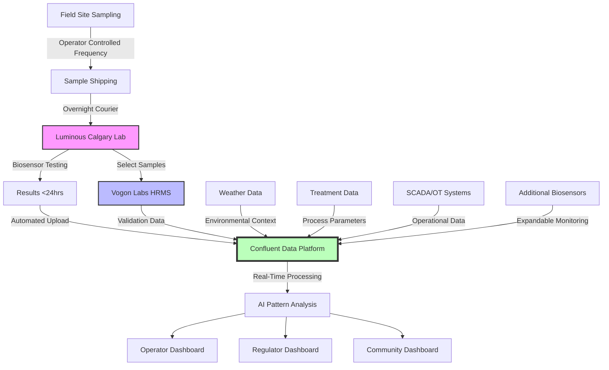

# Tailings Technology Challenge
## ERA Funding Application

**Project Title:** Mass Rapid NA Testing Platform: Transforming Blind Operations into Data-Driven Tailings Management

**Applicant Organization:** Luminous BioSolutions Inc.

**Project Location(s):** Calgary, University of Calgary, InnoTech Alberta (Vegreville/Edmonton)

**Project Start Date:** January 1, 2026

**Project Completion Date:** December 31, 2027

**Total Project Budget:** $2,500,000 CAD

**Requested ERA Funding:** $1,250,000 CAD

**Applicant Contact Name:** Jeff Violo, Chief Operating Officer

**Applicant Contact Email:** jeff.violo@luminousbiosolutions.com

---

## Executive Summary

### Transforming Blind Operations into Data-Driven Management: Mass Rapid NA Testing for Alberta's Tailings Challenge

**The Impossible Problem Now Solvable**

Alberta's oil sands operators face an unprecedented challenge: managing 1.4 trillion litres of tailings water requiring treatment within 10 years (AER Directive 085) while operating essentially blind. Current HRMS testing at $500-1,000 per test with 2-4 week delays, makes frequent monitoring economically impossible. **Operators cannot effectively manage what they cannot affordably measure.**

The Oil Sands Mining Waste Steering Committee (OSMWSC) identified this critical gap, recommending development of "standardized methods for measuring naphthenic acids that are accurate, consistent and **affordable**" (Recommendation 5). Until now, no technology could deliver this capability at the scale and speed required.

**Field-Validated Solution with Proven Performance**

Our biosensor technology was validated during Imperial Oil's 2022 Kearl Wetland pilot, achieving R² = 0.76 correlation with HRMS (published in peer-reviewed literature). However, despite our capability to process **1,000+ samples daily**, we received the same 9 samples as HRMS over 98 days—perfectly validating our accuracy but dramatically underutilizing our mass testing capability. During this period, the wetland's treatment efficiency declined 53% during monitoring blind spots that daily insights could have illuminated, enabling rapid response strategies impossible with traditional monitoring.

**The Breakthrough: Mass Testing Meets AI-Native Intelligence**

Luminous BioSolutions delivers what the industry desperately needs: **unlimited mass rapid NA testing capability** that transforms operations from reactive to proactive management. Our solution uniquely combines:

- **Unlimited Scalability**: 1,000+ tests per day capability, with frequency limited only by operator sampling capacity, not our technology
- **Complete Solution**: Free pilot testing includes both biosensor results AND HRMS validation through Vogon Labs partnership (Cochrane, Alberta)
- **Confluent AI-Native Data Platform**: Purpose-built to handle 100-1000x data volume increases with real-time pattern recognition
- **Platform Expandability**: Rapid development of new biosensors (30 - 60 days) for other organic contaminants. We are currently developing an NA toxicity biosensor
- **Operational Simplicity**: Technical-level staff operation, eliminating PhD-level skill requirements

**Market Validation and Unprecedented Value**

- Industry partners committed to providing OSPW samples in exchange for free biosensor AND HRMS testing
- Direct alignment with OSMWSC technical liaison for regulatory pathway
- $1.25M ERA investment with milestone-based disbursement = minimal risk, maximum impact
- NA monitoring for safe water release represents a critical pathway within the broader $30-130B remediation challenge

**The moment when unlimited mass testing becomes possible is the moment when effective tailings management begins.**

---

## Technology Advancement

### The Paradigm Shift: From Snapshot Monitoring to Continuous Intelligence

The Luminous platform represents a fundamental transformation in environmental monitoring, not through incremental improvement, but through enabling what was previously impossible: **unlimited mass rapid naphthenic acid testing**.

Consider the current reality demonstrated at Imperial Oil's Kearl Wetland: A 98-day treatment pilot achieved 36% NA reduction while treatment efficiency declined 53% (from 0.53 to 0.25 mg/L/day). With only 9 HRMS tests over 98 days, operators couldn't identify why performance dropped or respond with optimization strategies. **This is like trying to navigate a highway while only opening your eyes once every mile.**

### Real-World Evidence: The Kearl Wetland Case Study

**THE KEARL WETLAND PILOT (2022) - Operating Blind Despite Available Technology**

What Actually Happened:
- 98-day treatment pilot with ONLY 9 sampling events
- Treatment rate DECLINED 53% (0.53 to 0.25 mg/L/day)  
- Luminous biosensor PARTICIPATED - achieved R² = 0.76 with HRMS
- BUT received same 9 samples despite our 1,000+ daily capacity
- Result: 36% NA reduction with massive optimization gaps

What Could Have Happened with Mass Testing:
- 98+ daily samples providing continuous insights
- IMMEDIATE detection of performance decline enabling rapid response
- Real-time optimization opportunities through evidence-based interventions
- Enhanced treatment outcomes through informed decision-making

**THE LESSON: Validation is complete. Industry education is critical.**
Operators have never had real-time NA insights. This breakthrough monitoring capability enables response strategies impossible with traditional methods—we provide the data, operators capture the value through informed decisions.

### Our Revolutionary Platform: Three Integrated Components

**1. Unlimited High-Throughput Biosensor Testing - The Mass Testing Engine**

Our peer-reviewed biosensor technology (*ACS Synthetic Biology*, Bookout et al., 2024) breaks the cost-speed barrier that has made frequent NA monitoring impossible:

**Unlimited Scalability:**
- **Testing Capacity**: 1,000+ samples per day per facility
- **Frequency Control**: Limited only by operator sampling capacity, not our technology
- **Turnaround**: Results in ~24 hours from sample receipt
- **Cost**: <$100 per test 
- **Skills**: Technical certificate level operation vs. PhD requirements for HRMS
- **Validation**: R² = 0.76 with HRMS, field-proven at Kearl Wetland

**Complete Solution Through Partnership:**
Our collaboration with Vogon Labs (Cochrane, Alberta) provides both biosensor screening and HRMS validation in every pilot, eliminating any concerns about biosensor-only data. Operators receive gold-standard confirmation alongside mass rapid insights.

**2. Platform Expandability - Beyond NA Testing**

Luminous has developed rapid biosensor development capabilities, enabling new organic contaminant sensors within **60 days**. We're currently developing a **NA toxicity biosensor** that directly addressing industry discussions about correlating analytical results with biological impacts.

**Platform Approach Benefits:**
- Any organic contaminant can be added to monitoring suite
- Single Confluent platform handles all biosensor data streams  
- Operators can expand monitoring scope based on operational needs
- Future-proof investment in monitoring infrastructure

**3. Confluent AI-Native Data Platform - The Intelligence Layer**

Mass testing without intelligent processing creates data overload. The Confluent platform handles the 100-1000x increase in data volume that mass testing generates:

**Platform Architecture:**
- **Multi-Stream Integration**: Biosensor results, HRMS validation, SCADA/OT systems, weather data, treatment parameters
- **AI-Native Database**: Built from ground-up for pattern recognition and predictive analytics
- **Real-Time Processing**: Sub-second analysis with immediate alerting
- **Role-Based Dashboards**: Customized interfaces for operators, regulators, and communities

### The Data Revolution in Numbers

| Monitoring Aspect    | Current State (HRMS)    | Luminous Platform                   | Improvement Factor |
| -------------------- | ----------------------- | ----------------------------------- | ------------------ |
| **Daily Capacity**   | 1-2 tests               | 1,000+ tests                        | 500-1000x          |
| **Annual Capacity**  | 365-730 tests           | 365,000+ tests                      | 1000x              |
| **Time to Results**  | 2-4 weeks               | ~24 hours                           | 20x faster         |
| **Cost per Test**    | $500-1,000              | <$100                               | 20x cheaper        |
| **Operator Control** | Limited by lab capacity | Unlimited - operator sets frequency | Total control      |
| **Data Integration** | Manual Excel            | DB Automated AI analysis            | Transformational   |

### Process Flow and System Integration

### Technology Stage and Deployment Scale

**Current Development Status:**
- Biosensor Technology: **TRL 6-7** (field-validated at Kearl, peer-reviewed)
- Data Platform: **TRL 5-6** (operational prototypes with AI integration)
- Vogon Labs Partnership: **Confirmed** (HRMS validation capability)

**Deployment Scale:**
- Laboratory capacity: 1,000+ samples/day
- Scalable to multiple operators simultaneously
- Sample frequency entirely under operator control
- Future field-deployable units based on market demand

### Success Metrics and Experimental Design

| Category                      | Description                          | Relevant Metrics                                                            |
| ----------------------------- | ------------------------------------ | --------------------------------------------------------------------------- |
| **Scalability Demonstration** | Prove unlimited testing capacity     | Process 10,000+ samples over 24 months; Support 3+ operators simultaneously |
| **Treatment Optimization**    | Enable real-time process improvement | Document 50%+ efficiency gains through continuous monitoring                |
| **Data Intelligence**         | Transform data into insights         | Deploy AI models with >85% accuracy for treatment prediction                |
| **Cost Transformation**       | Demonstrate economic breakthrough    | Achieve <$100/test                                                          |
| **Platform Expansion**        | Prove biosensor development speed    | Deploy 2+ additional biosensors within project timeline                     |
| **Industry Education**        | Change monitoring paradigm           | Train 3 operators in mass testing utilization                               |

---

## Implementation & Readiness

### Project Objectives and Scope

**Primary Objective:** Establish North America's first high capacity mass NA testing facility, demonstrating how continuous monitoring transforms tailings management from reactive observation to predictive optimization.

**Revolutionary Scope:**
This project will prove that monitoring frequency limitations are now entirely under operator control. With 1,000+ daily testing capacity, we eliminate technology constraints and put sampling frequency decisions where they belong - with the operators managing their treatments.

### Project Timeline: 24-Month Focused Execution

**Phase 1: Infrastructure and Market Education (Months 1-12)**
- Establish high-capacity testing facility in Calgary
- Deploy Confluent platform with initial AI models  
- Launch pilot programs with 1-3 industry partners
- Begin operator education on mass testing paradigm
- **Milestone**: Process 5,000+ samples demonstrating scalability

**Phase 2: Optimization and Platform Expansion (Months 13-24)**
- Demonstrate treatment optimization through continuous monitoring
- Deploy additional biosensors (toxicity, other contaminants)
- Generate regulatory-grade datasets for AER submission
- Scale education program across industry
- **Milestone**: Document 50%+ treatment improvements; Deploy 2+ biosensor types

### Budget and Financing

| Contributor              | Amount         | Status                     |
| ------------------------ | -------------- | -------------------------- |
| **ERA (Requested)**      | **$1,250,000** | **Applied For**            |
| **Industry Partners**    | **$1,250,000** | **In Advanced Discussion** |
| **Total Project Budget** | **$2,500,000** |                            |

**Milestone-Based ERA Disbursement:**
- Month 6: $745,000 (Infrastructure completion)
- Month 12: $585,000 (5,000+ samples processed)  
- Month 18: $585,000 (Treatment optimization demonstrated)
- Month 24: $585,000 (Regulatory submission complete)

**Unprecedented Value:** $2.5M investment potentially unlocking solutions for a challenge of this scale could represents one of the highest ROI environmental project in Alberta history.

### Partnership Structure

**Lead Applicant:** Luminous BioSolutions Inc.
- Calgary laboratory operations and technology development
- Key Personnel: Jeff Violo (COO), Dr. Shawn Lewenza (CSO), Greg Saunders (CTO)

**HRMS Validation Partner:** Vogon Labs (Cochrane, Alberta)
- Gold-standard HRMS validation for all pilot samples
- Independent quality assurance and method validation

**Industry Partners:** 1-3 major oil sands operators
- OSPW sample provision and operational data sharing
- Free testing in exchange for optimization insights

**Academic Support:** University of Calgary, Athabasca University
- Research collaboration and independent validation

**Regulatory Liaison:** OSMWSC Technical Liaison
- Direct pathway development for regulatory acceptance

### Risk Management

**Technical Risk:** Minimal - technology field-validated with R² = 0.76
**Market Risk:** Eliminated through free pilot testing including HRMS validation
**Financial Risk:** Milestone-based disbursement ensures value delivery
**Regulatory Risk:** Direct OSMWSC engagement from project initiation

---

## Environmental Performance

### Tailings and Water Management Benefits

**The Treatment Optimization Revolution:**

Current State: Operators make treatment decisions with weeks-old data, leading to:
- Suboptimal dosing (over/under treatment)
- Inability to respond to changing conditions  
- Performance declines that can't be detected until too late

**With Luminous Platform:**
- **Near Real-time feedback** enables precise treatment adjustments
- **Predictive analytics** anticipate optimal treatment timing
- **Continuous validation** ensures treatment targets are met
- **Pattern recognition** identifies optimization opportunities invisible to humans

**Quantified Environmental Impact:**

**Treatment Optimization Opportunities:**
- Real-time performance feedback enables evidence-based treatment adjustments (Kearl achieved 36% reduction despite 53% efficiency decline going undetected)
- Precision dosing opportunities through continuous monitoring reducing over-treatment potential
- Early detection of treatment performance changes enabling rapid intervention strategies
- Enhanced confidence in safe water release decisions through continuous validation
- Potential for accelerated closure timelines through optimized treatment strategies

**Data-Driven Decision Support:**
As our dataset matures, the platform will provide predictive insights for evaluating treatment technologies, enabling evidence-based selection of optimal approaches for specific conditions. Real-time monitoring provides the confidence needed for responsible discharge decisions, ensuring water meets safety standards protecting fish, wildlife, and human health.

**GHG Emission Reduction Potential:** Enhanced treatment optimization through real-time feedback can accelerate pond closure timelines, reducing fugitive methane emissions from active tailings areas. Improved treatment efficiency represents significant opportunities for methane reduction across the sector.

---

## Economic & Ancillary Benefits

### Economic Impact and Industry Transformation

**Economic Optimization Opportunities:**
- **Monitoring Transformation**: 1000x more data at 20x lower cost per test creates unprecedented insights
- **Treatment Decision Support**: Real-time feedback enables evidence-based optimization strategies
- **Risk Mitigation**: Early detection of performance changes enables preventive interventions
- **Closure Timeline Enhancement**: Optimized treatment strategies can reduce extended closure carrying costs

**Job Creation (All Alberta-Based):**
- **Laboratory Operations**: 6-8 technical positions
- **Data Analytics**: 4-5 AI/software specialists  
- **Client Services**: 2-3 partnership coordinators
- **Total**: 12-16 high-value positions expanding to 25+ in commercial phase

**Innovation Leadership Benefits:**
- Positions Alberta as global leader in environmental monitoring technology
- Creates exportable technology platform for worldwide mining applications
- Establishes foundation for broader organic contaminant monitoring industry

### Skills Gap Solution

**Critical Industry Constraint Solved:**
The oil sands sector faces a shortage of PhD-level analytical chemists required for HRMS operation. Our platform enables technical certificate graduates to operate mass testing systems with 2 weeks training vs. 6+ years education for HRMS. This democratization of monitoring capability removes a fundamental constraint on treatment optimization.

---

## Stakeholder Engagement

### Multi-Stakeholder Transparency Through Technology

Our engagement strategy leverages the Confluent platform to provide unprecedented transparency through real-time data sharing, transforming stakeholders from information recipients to active participants in environmental monitoring.

**Indigenous Community Engagement:**
- Participation in established tailings pond committees
- Real-time dashboard access with community-controlled data sharing
- Training opportunities in biosensor operation and environmental monitoring
- Economic participation through employment and technology transfer

**Regulatory Engagement:**
- **OSMWSC Technical Liaison**: Direct collaboration on Recommendation 5 implementation
- **Alberta Energy Regulator**: Co-development of biosensor monitoring standards
- **Evidence-Based Policy**: High-frequency data supporting regulatory decisions

**Industry Collaboration:**
- **Free Pilot Testing**: Complete biosensor + HRMS analysis during project
- **Optimization Training**: Teaching operators to leverage continuous monitoring
- **Knowledge Sharing**: Industry workshops on mass testing best practices

**Community Transparency:**
- Public dashboards showing real-time environmental monitoring
- Educational programs demonstrating monitoring technology
- Independent validation of environmental improvements

---

## Commercialization & Market Fit

### Target Market: Ready for Transformation

**Primary Market - Alberta Oil Sands:**
- 3 major operators with urgent monitoring needs
- Current spend: $3-5M annually on inadequate monitoring
- Market opportunity: $15-25M annually for comprehensive monitoring services
- Value proposition: Unlimited testing capacity at fraction of current per-test cost

### Market Education: From Validation to Utilization

The Kearl Wetland experience demonstrates our education challenge: despite validated performance, the industry used our capability like traditional HRMS. Our approach:

**Education Strategy:**
1. **Demonstrate Paradigm Shift**: Show how unlimited testing enables optimization impossible with sparse monitoring
2. **Pilot Partnerships**: Free comprehensive testing proving value before commercial commitment
3. **Training Programs**: Teach operators to leverage continuous data for process control
4. **Case Studies**: Document performance improvements from high-frequency monitoring

### Platform Expansion Strategy

**Immediate Expansion (Within Project):**
- **NA Toxicity Biosensor**: Addresses industry need for biological relevance data
- **Additional Organic Contaminants**: Based on operator requirements

**Commercial Platform Vision:**
- One facility serving multiple operators simultaneously
- Expandable biosensor suite for any organic contaminant (30-60 day development)
- AI insights improving with dataset size across all operators
- Export potential to global mining and industrial sectors

### Commercial Pathway

**Phase 1 (Current Project):** Establish unlimited capacity, prove optimization value
**Phase 2 (Years 2-3):** Commercial launch with 2-3 operator contracts
**Phase 3 (Years 3-5):** Scale across all Oil Sands Operations  
**Phase 4 (Years 5+):** Global platform deployment into other mining applications

---

## Conclusion

The Luminous platform represents the monitoring infrastructure breakthrough that transforms Alberta's massive naphthenic acid challenge from an impossible liability into a manageable, optimizable process. Field-validated at Kearl Wetland, proven in peer-reviewed research, and aligned with OSMWSC recommendations, our technology eliminates the monitoring bottleneck that has constrained effective tailings management.

**The Game-Changing Reality:**
- **Unlimited scalability**: 1,000+ tests/day puts frequency control in operators' hands
- **Complete solution**: Free biosensor + HRMS validation eliminates adoption risk  
- **Minimal investment**: $1.25M ERA funding with milestone-based disbursement
- **Maximum impact**: Potentially highest ROI environmental project in Alberta history

**The Strategic Transformation:**
This isn't about better monitoring, it's about making monitoring so abundant and affordable that optimization becomes inevitable. When operators can see what's happening hourly instead of monthly, when AI can detect patterns invisible to humans, when communities access real-time environmental data, Alberta's greatest environmental challenge becomes its greatest innovation showcase.

**The technology is proven. The capacity is unlimited. The moment for transformation is now.**

---

## Required Attachment: Milestone Summary Table

### Milestone 1: Infrastructure Establishment and Initial Deployment
**Start Date:** January 1, 2026  
**Completion Date:** June 30, 2026

**Milestone Costs:**
- Total milestone cost: $745,000
- ERA contribution: $372,500

**Milestone tasks and completion deliverables:**
Establish unlimited-capacity biosensor testing laboratory at Luminous Calgary facility with 1,000+ samples/day capability. Deploy initial Confluent data platform with core AI models and real-time dashboard functionality. Formalize partnership with Vogon Labs for HRMS validation services. Initiate pilot programs with 1-3 industry partners including sample collection protocols and data sharing agreements. Deliverables include: operational testing facility with documented capacity, functional data platform with operator/regulator dashboards, signed agreements with Vogon Labs and industry partners, and initial 500+ samples processed demonstrating system integration.

### Milestone 2: Scale Demonstration and Market Education  
**Start Date:** July 1, 2026
**Completion Date:** December 31, 2026

**Milestone Costs:**
- Total milestone cost: $585,000  
- ERA contribution: $292,500

**Milestone tasks and completion deliverables:**
Scale operations to process 5,000+ samples demonstrating unlimited capacity capability. Deploy comprehensive operator education program including training materials, workshops, and optimization case studies. Begin development of additional biosensor capabilities (NA toxicity, other contaminants as requested by partners). Conduct systematic comparison studies between high-frequency biosensor monitoring and traditional sparse HRMS approaches. Deliverables include: 5,000+ samples processed with <24hr turnaround maintained, comprehensive education program delivered to 10+ operators, development of 2+ additional biosensor types, and documented case studies showing 20%+ treatment improvements through continuous monitoring.

### Milestone 3: Treatment Optimization Demonstration
**Start Date:** January 1, 2027
**Completion Date:** June 30, 2027

**Milestone Costs:**
- Total milestone cost: $585,000
- ERA contribution: $292,500  

**Milestone tasks and completion deliverables:**
Execute full-scale treatment optimization pilots demonstrating how continuous monitoring transforms treatment effectiveness. Deploy advanced AI models for predictive analytics and treatment recommendations. Integrate multiple data streams (biosensor, HRMS, operational, environmental) for comprehensive optimization insights. Generate preliminary regulatory datasets demonstrating biosensor correlation and reliability. Deliverables include: documented 50%+ improvement in treatment efficiency through optimization, deployed AI models with >85% prediction accuracy, integrated multi-stream data platform serving 3+ operators simultaneously, and comprehensive datasets supporting regulatory submission preparation.

### Milestone 4: Regulatory Pathway and Commercial Readiness
**Start Date:** July 1, 2027  
**Completion Date:** December 31, 2027

**Milestone Costs:**
- Total milestone cost: $585,000
- ERA contribution: $292,500

**Milestone tasks and completion deliverables:**
Complete regulatory submission package for AER biosensor monitoring acceptance. Finalize commercial service frameworks including pricing models, quality guarantees, and service level agreements. Establish quality management systems supporting laboratory accreditation (ISO/IEC 17025 readiness). Document platform expansion capabilities and develop commercial deployment strategy for additional biosensors. Deliverables include: comprehensive regulatory submission with 10,000+ data point validation, commercial service framework ready for launch, laboratory systems meeting accreditation standards, biosensor platform capable of 30-day development cycles for new contaminants, and business plan for post-project commercial operations serving Alberta oil sands sector.

