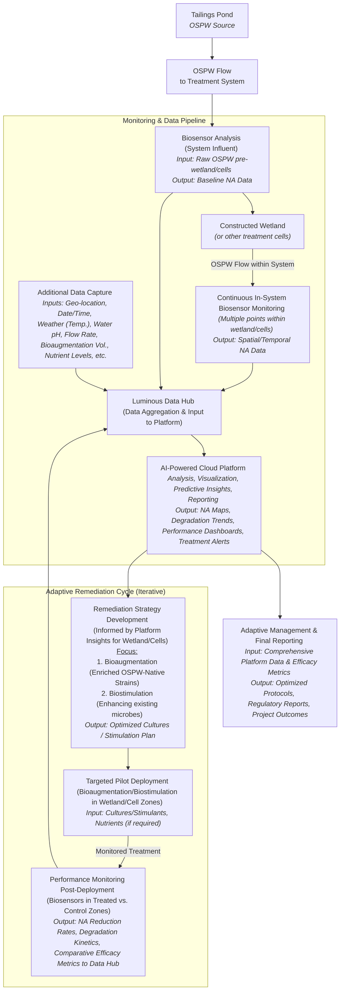

**Technology Opportunity**

**Our Solution: An Integrated Biological Approach to Naphthenic Acid Management**

Luminous BioSolutions is advancing an integrated biotechnological platform designed to address the complex and persistent challenge of Naphthenic Acids (NAs) in oil sands process-affected water (OSPW). Current analytical and remediation methodologies face limitations in terms of speed, cost, scalability, and environmental footprint when applied to the vast scale of oil sands tailings facilities. Our approach leverages microbiological principles for a more efficient, sustainable, and data-driven solution:

1. **Rapid, Quantitative Biosensing of Naphthenic Acids:** The foundation of our platform is a panel of proprietary whole-cell bacterial biosensors. These biosensors are engineered using _Pseudomonas_ species, strains native to tailings environments, and specific NA-inducible promoters (e.g., atuA, marR) fused to luxCDABE reporter genes. Upon exposure to NAs, these biosensors exhibit a rapid bioluminescent response, typically within minutes, with light intensity directly proportional to NA concentration. This allows for quantitative assessment. Our research, as detailed in Bookout et al. (2024), demonstrates that these sensors can detect various NA mixtures with limits of detection between **1.5 and 15 mg/L**, a range highly relevant to OSPW conditions (typically 10-120 mg/L NAs ). This technology enables high-throughput screening and near real-time monitoring, offering a significant improvement in data resolution and operational responsiveness compared to conventional analytical chemistry methods. 
![[Pasted image 20250527145927.png]]
	_(A conceptual diagram illustrating the promoter-reporter mechanism would be appropriate here)._
    
2. **Targeted Biological Remediation Strategy:** Beyond detection, our platform facilitates enhanced NA bioremediation. Recognizing the inherent resilience and metabolic capabilities of indigenous OSPW microbial communities, our strategy focuses on:
    
    - **Identifying Potent Native Degraders:** Leveraging our biosensors as high-throughput screening tools to rapidly identify and isolate the most effective NA-degrading bacteria already present and adapted to the harsh OSPW matrix (e.g., varying pH, salinity, co-contaminants).
        
    - **Bioaugmentation & Biostimulation:** This ERA project will pilot the deployment of these selected, superior OSPW-native cultures (bioaugmentation) and explore biostimulation techniques to enhance the degradative activity of the existing microbial consortia _in situ._ This biological approach aims for sustainable NA degradation with a lower environmental footprint and potentially lower operational costs compared to energy-intensive chemical oxidation or physical separation methods, which can also produce secondary waste streams.
        
3. **Data-Driven Environmental Management Platform:** Data from our biosensors are integrated into a cloud-based analytics platform. This system provides real-time visualization of NA spatial and temporal trends, incorporates AI for predictive insights into NA dynamics, and supports streamlined regulatory reporting and transparent stakeholder communication.
    

**Process Flow Diagram** 

**The Problem: A Persistent Challenge Requiring Innovative Solutions** The presence of NAs in the ~1.4 trillion litres of OSPW within Alberta's oil sands tailings ponds is a primary contributor to OSPW toxicity and a critical barrier to achieving sustainable reclamation and water management objectives. These compounds delay land reclamation, escalate environmental risks, and contribute to substantial long-term financial liabilities for operators. Existing management practices often struggle with the scale, cost, and desire for environmentally benign solutions, highlighting a clear market need for innovative technologies that are both effective and sustainable.

**Transformative Improvement through Integrated Biotechnology** Our integrated biological platform offers a distinct advancement:

- **Enhanced Spatiotemporal Understanding:** Rapid, cost-effective monitoring facilitates a shift from infrequent, low-density sampling to high-resolution mapping of NA distribution and dynamics.
- **Targeted and Sustainable Remediation:** Utilizing adapted, OSPW-native microbes for _in-situ_ degradation offers a potentially more environmentally compatible and cost-effective alternative to chemical or energy-intensive physical treatments, minimizing secondary impacts.
- **Adaptive Management Capability:** Real-time data enables proactive and adaptive management of both monitoring programs and remediation efforts, optimizing for performance and cost.

**(Competitive Landscape & Luminous's Differentiators)** Current NA management involves conventional analytical labs (e.g., GC-MS, FTIR) for monitoring, which are accurate but resource-intensive and slow. Remediation alternatives include physical-chemical methods (e.g., AOPs, activated carbon) which can be costly, energy-demanding, and may generate residuals, or passive biological systems like constructed wetlands, which have large footprints and less process control. Luminous's primary differentiators are:

- **Integrated System:** The synergistic combination of rapid, quantitative biosensing with data-driven, biologically-based remediation support.
- **Specificity & Speed in Monitoring:** Our biosensor panel, validated against OSPW and NAFC extracts, offers timely data crucial for effective operational response.
    
- **Adaptive Bioremediation:** The ability to select and deploy (or stimulate) OSPW-acclimatized microbes, guided by real-time monitoring, enhances the efficiency and resilience of the biological treatment process. This biological pathway inherently avoids the harsh chemical inputs or high energy demands of many alternative approaches.

**(Novelty, Innovation & Sustainable Competitive Advantage)** The innovation lies in:

1. The development and application of a **panel of whole-cell biosensors** tailored for complex NA mixtures in OSPW, as scientifically detailed in Bookout et al. (2024).
    
2. The **data-driven linkage** between high-resolution monitoring and the selection/enhancement of robust, site-specific biological remediation agents.
3. The **AI-enhanced analytics platform** that translates complex biological responses into actionable environmental intelligence. This integrated biological system offers a sustainable advantage through superior data velocity, cost-effectiveness in monitoring, and an environmentally congruent approach to remediation, leading to more efficient and reliable tailings water management.

**(Current Status & Project Advancement)** The foundational biosensor technology has achieved TRL 5-6, with functionality demonstrated on actual OSPW samples and various NA mixtures in lab settings. The conceptual framework for the integrated bioremediation and data analytics components is well-defined. **This ERA-funded project is designed to advance the entire integrated Luminous system to TRL 7-8.** This involves deploying and validating the technology at pilot scale within an operational oil sands environment, demonstrating its efficacy, robustness, and scalability under real-world conditions.

**(ERA's Role in Accelerating Commercialization)** ERA investment is critical to:

- **Validate Field Performance & Scalability:** Bridge the gap from controlled lab environments to the complexities of operational tailings facilities, resolving uncertainties around performance in variable OSPW and at a larger scale.
- **Generate Bankable Data:** Produce the comprehensive, quantitative performance data required by industry operators for adoption and by the AER for regulatory consideration.
- **Optimize the Biological System:** Utilize field data to refine biosensor deployment, optimize the selection and application of bioremediation cultures (or biostimulation parameters), and enhance the predictive capabilities of the data platform.
- **Catalyze a Sustainable Solution:** Support the advancement of a biological solution that offers significant environmental (reduced toxicity, enabling reclamation) and economic (lower monitoring and potentially remediation costs) advantages over conventional chemical/mechanical strategies, aligning with industry's need for effective and sustainable technologies. This project, with ERA's support, will de-risk key technical and operational aspects, significantly accelerating the path to commercial deployment of a uniquely integrated biological solution for NA management.