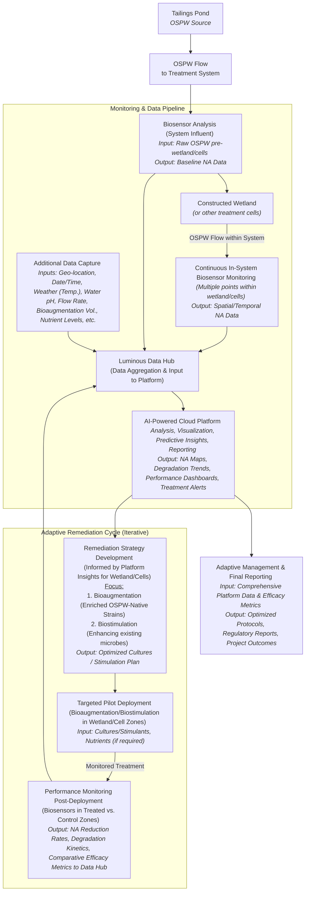

# 1 Technology Opportunity

**Our Solution: An Integrated Biological Approach to Naphthenic Acid Management**

Luminous BioSolutions is advancing an integrated biotechnological platform designed to address the complex and persistent challenge of Naphthenic Acids (NAs) in oil sands process-affected water (OSPW). Current analytical and remediation methodologies face limitations in terms of speed, cost, scalability, and environmental footprint when applied to the vast scale of oil sands tailings facilities. Our approach leverages microbiological principles for a more efficient, sustainable, and data-driven solution:

1. **Rapid, Quantitative Biosensing of Naphthenic Acids:** The foundation of our platform is a panel of proprietary/patented 1 whole-cell bacterial biosensors. These biosensors are engineered using _Pseudomonas_ species, strains native to tailings environments, and specific NA-inducible promoters (e.g., atuA, marR, 3680) fused to luxCDABE reporter genes. Upon exposure to NAs, these biosensors exhibit a rapid bioluminescent response, typically within minutes, with light intensity directly proportional to NA concentration. These promoters control the expression of bioremediation or antibiotic efflux genes, allowing bacteria to degrade certain NAs, and to pump other more toxic NAs compounds. Increasing luminescence with increasing NA concentration allows for quantitative assessment. Our research, as detailed in Bookout et al. (2024), demonstrates that these sensors can detect various NA mixtures with limits of detection between **1.5 and 15 mg/L**, a range highly relevant to OSPW conditions (typically 10-120 mg/L NAs ). This technology enables high-throughput screening and near real-time monitoring, offering a significant improvement in data resolution and operational responsiveness compared to conventional analytical chemistry methods. 
![[Pasted image 20250527145927.png]]
	Figure 1. Naphthenic acids enter the cell, are sensed, which leads to the induced expression of genes specific to transport, degrade, or pump out various NA compounds, leading to the production of light from the *lux* reporter. 
    
2. **Targeted Biological Remediation Strategy:** Beyond detection, our platform facilitates enhanced NA bioremediation. Recognizing the inherent resilience and metabolic capabilities of native OSPW microbial communities, our strategy focuses on:
    
    - **Identifying Potent Native NA Degraders:** Our biosensors can rapidly measure the degradation of NA in small volume, high-throughput culture conditions, resulting in an ideal method to rapidly screen 100s - 1000s of bacterial isolates recovered from tailings water. We will identify a simple, stable bacterial community with the most effective NA-degrading properties possible.
        
    - **Bioaugmentation & Biostimulation:** This ERA project will pilot the large volume bioreactor growth and deployment of these selected, superior OSPW-native cultures (bioaugmentation) in a mesocosm scale, bioremediation experimental system. We will also explore biostimulation by the addition of proprietary nutrients to enhance the degradation activity of the existing and/or exogenous microbial consortia _in situ. This biological approach aims for sustainable NA degradation with a lower environmental footprint and potentially lower operational costs compared to energy-intensive chemical oxidation or physical separation methods, which can also produce secondary waste streams. What about the wetlands?
        
3. **Data-Driven Environmental Management Platform:** Data from our biosensors are integrated into a cloud-based analytics platform. This system provides real-time visualization of NA spatial and temporal trends, incorporates AI for predictive insights into NA dynamics, and supports streamlined regulatory reporting and transparent stakeholder communication.
    

**Process Flow Diagram** 

**The Problem: A Persistent Challenge Requiring Innovative Solutions** The presence of NAs in the ~1.4 trillion litres of tailings within Alberta's oil sands tailings ponds is a primary contributor to OSPW toxicity and a critical barrier to achieving sustainable reclamation and water management objectives. These compounds delay land reclamation, escalate environmental risks, and contribute to substantial long-term financial liabilities for operators. Existing management practices struggle with the scale, cost, and desire for environmentally benign solutions, highlighting a clear market need for innovative technologies that are both effective and sustainable.

**Transformative Improvement through Integrated Biotechnology** Our integrated biological platform offers a distinct advancement:

- **Enhanced Spatiotemporal Understanding:** Rapid, cost-effective monitoring facilitates a shift from infrequent, low-density sampling to high-resolution mapping of NA distribution and dynamics.
- **Targeted and Sustainable Remediation:** Utilizing adapted, OSPW-native microbes for _in-situ_ degradation offers a potentially more environmentally compatible and cost-effective alternative to chemical or energy-intensive physical treatments, minimizing secondary impacts.
- **Adaptive Management Capability:** Real-time data enables proactive and adaptive management of both monitoring programs and remediation efforts, optimizing for performance and cost.

**Competitive Landscape & Luminous's Differentiators**

Current Naphthenic Acid (NA) management in the oil sands utilizes a range of tools and strategies. Conventional analytical labs (e.g., GC-MS, FTIR) provide accurate NA monitoring but are resource-intensive and yield results with significant time lags. For remediation, alternatives include physical-chemical methods (e.g., Advanced Oxidation Processes, activated carbon) which can be effective but often involve high operational costs, substantial energy demands, and potentially generate secondary waste streams. Passive biological systems like constructed wetlands are under investigation; these offer a more natural approach but typically have large footprints and offer less direct process control over NA degradation rates.

Luminous BioSolutions is designed to enhance and integrate with these existing frameworks, offering unique advantages and synergies:

- **Integrated & Adaptive Intelligence (Our Core Differentiator):** Our primary innovation is the synergistic combination of rapid, quantitative biosensing with a data-driven platform that supports and optimizes biologically-based remediation efforts. This creates an intelligent, adaptive system.
- **High-Resolution Monitoring that Complements Precision Analytics:** Our biosensor panel, validated against OSPW and NAFC extracts, provides timely, cost-effective data essential for high-frequency operational monitoring. This doesn't replace the need for occasional, targeted GC-MS or other high-resolution lab analyses; rather, our biosensors provide the broad, real-time understanding to guide when and where these more intensive analyses are most valuable, ensuring resources are used efficiently.
- **Accelerating Nature-Based Solutions (e.g., Constructed Wetlands):** Our adaptive bioremediation approach, focusing on OSPW acclimatized microbes, is a powerful complement to systems like constructed wetlands. By identifying optimal native microbial consortia or designing effective biostimulation strategies based on real-time biosensor data from within the wetland, we can significantly enhance the NA degradation efficiency and resilience of these biological systems. This means potentially smaller footprints or faster throughput for existing or new wetland designs.
- **Agnostic Data Platform for Holistic Oversight:** Our analytics platform is designed to be versatile. While it natively integrates our biosensor data, it can also incorporate data inputs from various other sensors and monitoring techniques (e.g., pH, temperature, flow rates, even results from conventional lab analyses). This allows for a more holistic, centralized view of the entire treatment process, providing comprehensive insights into the current state and progress of NA remediation, regardless of the specific combination of technologies employed.
- **Targeted Biological Enhancement vs. Broad Chemical/Physical Intervention:** Our biological pathway, focused on selecting and stimulating robust OSPW native microbes, inherently aims to minimize the harsh chemical inputs or high energy demands characteristic of many alternative standalone remediation methods. This offers a more environmentally congruent and potentially more cost-effective route to achieving NA reduction targets.

Luminous BioSolutions seeks to provide the critical missing pieces; rapid, actionable intelligence and targeted biological enhancements, that can make existing and future NA management strategies more efficient, effective, cost-conscious, and environmentally sound.

**Novelty, Innovation & Sustainable Competitive Advantage** 

Our innovation is driven by a unique confluence of cutting-edge science and a dedicated commercialization focus. The scientific underpinnings of our biosensors are detailed in publications such as Bookout et al. (2024). However, Luminous BioSolutions was founded by microbiologists specifically to accelerate such promising research into field-deployable, commercial applications for NA management. Unlike many advancements that remain primarily within academic institutions, our core mission is to provide a holistic, integrated, and practical biological solution to the oil sands industry. This singular focus on NAs, from rapid detection to enhanced bioremediation and intelligent data analysis, provides us with deep, specialized expertise and a clear pathway to delivering tangible results in a complex operational ecosystem. Our advantage stems not just from individual technological components, but from this dedicated, expert-driven mission to solve the NA challenge comprehensively.

**Current Status & Project Advancement** The foundational biosensor technology has achieved TRL 5-6, with functionality demonstrated on actual OSPW samples and various NA mixtures in lab settings and a wetlands field trial. The conceptual framework for the integrated bioremediation and data analytics components is well-defined. This ERA-funded project is designed to advance the entire integrated Luminous system to TRL 7-8. This involves deploying and validating the technology first at at a Meocosm facility then moving towards a pilot scale within an operational oil sands environment, demonstrating its efficacy, robustness, and scalability under real-world conditions.

**ERA's Role in Accelerating Commercialization** 

ERA’s partnership is vital in enabling a specialized, expert-driven company like Luminous to translate deep scientific understanding of NA microbiology into a commercially viable, impactful solution for Alberta. 

- **Validate Field Performance & Scalability:** Bridge the gap from controlled lab environments to the complexities of operational tailings facilities, resolving uncertainties around performance in variable OSPW and at a larger scale.
- **Generate Bankable Data:** Produce the comprehensive, quantitative performance data required by industry operators for adoption and by the AER for regulatory consideration.
- **Optimize the Biological System:** Utilize field data to refine biosensor deployment, optimize the selection and application of bioremediation cultures (or biostimulation parameters), and enhance the predictive capabilities of the data platform.
- **Catalyze a Sustainable Solution:** Support the advancement of a biological solution that offers significant environmental (reduced toxicity, enabling reclamation) and economic (lower monitoring and potentially remediation costs) advantages over conventional chemical/mechanical strategies, aligning with industry's need for effective and sustainable technologies. This project, with ERA's support, will de-risk key technical and operational aspects, significantly accelerating the path to commercial deployment of a uniquely integrated biological solution for NA management.

# 2. Implementation Plan

Our Implementation Plan is built on a staged, iterative methodology, moving from controlled mesocosm environments to operational field pilots. This scientifically grounded approach ensures systematic de-risking, allows for cost-effective optimization at each step, and validates the modular scalability of our integrated Naphthenic Acid (NA) management platform, ensuring a high probability of success in addressing this critical challenge for Alberta's oil sands.

**Overall Objectives, Work Scope, and Deliverables**

The overarching goal is to demonstrate and validate the Luminous BioSolutions platform as a technically robust, environmentally sound, and economically viable solution for managing NAs in oil sands process-affected water (OSPW).

**Key Project Objectives:**

1. **Validate Biosensor Performance & Optimize Remediation Strategies in Mesocosms:** Rigorously test and validate the accuracy, speed, cost-effectiveness, and robustness of our NA biosensor panel under diverse, controlled OSPW conditions (e.g., varying soil, presence of plants) within mesocosm environments. Utilize these real-time biosensor insights to screen, identify, and optimize the most effective bioremediation strategies (bioaugmentation with OSPW-native strains and/or biostimulation).
2. **Demonstrate Integrated System Efficacy in Field Pilots:** Successfully deploy and validate the _entire integrated Luminous system_ incorporating optimized biosensor monitoring protocols and the most promising bioremediation strategies identified in mesocosms at pilot scale within an operational oil sands tailings environment, benchmarking against control areas.
3. **Validate Advanced Data Analytics & Adaptive Management Capabilities:** Showcase the functionality of our AI-powered cloud platform to seamlessly ingest, analyze, and visualize complex, multi-source data (from biosensors, operational parameters, environmental inputs across both mesocosm and field stages), providing actionable insights for real-time adaptive management of the remediation process.
4. **Generate Comprehensive Datasets for Commercial & Regulatory Pathways:** Collect robust, quantitative data on overall technical performance (NA degradation kinetics, biosensor reliability, system stability), holistic environmental benefits (NA reduction, potential GHG mitigation), and key operational parameters from all project stages to support engagement with the AER and build a strong economic case for commercial-scale deployment.
5. **Establish & Document Scalable, Modular Operational Best Practices:** Develop and refine clear, transferable protocols for the efficient deployment, operation, maintenance, and data interpretation of the integrated Luminous system (including biosensor arrays, bioremediation application, and data management), ensuring its design is conducive to modular, linear scale-up for larger commercial applications in the oil sands.

**Work Scope:** The project will initiate with the design, construction, and operation of controlled mesocosm systems. These will act as scaled-down analogues of constructed wetlands or pond sections, allowing us to test our biosensors and compare bioremediation approaches (e.g., OSPW only; OSPW with soil; OSPW with soil and native plants; OSPW with soil, plants, and specific microbial inocula). Learnings will then inform the design and execution of a field pilot at a selected oil sands operational site. This will involve establishing contained pilot zones (treated vs. control), deploying our integrated monitoring and remediation technologies, and conducting continuous performance assessment. Throughout both phases, our data analytics platform will be central to tracking, analysis, and adaptive management.

**Key Deliverables:**

- Mesocosm Design & Operational Plan.
- Mesocosm Trials Performance & Optimization Report (detailing biosensor validation and comparative bioremediation strategy efficacy).
- Field Pilot Detailed Design & Implementation Plan (informed by mesocosm outcomes).
- Validated Biosensor Field Performance Report.
- Field Pilot Bioremediation Efficacy Report (including NA reduction rates, degradation kinetics).
- Fully operational Data Analytics Platform with pilot data.
- Comprehensive Final Project Report (technical achievements, GHG/economic analysis, operational learnings, modular scale-up recommendations).
- MMV Report for ERA.
- Knowledge Dissemination Materials.

**Nature of Deployment, Size/Scale, and Relevance to Commercial System** This project features a two-stage deployment: mesocosm trials followed by a field pilot demonstration.

- **Mesocosm Stage (e.g., Years 1-2):** These controlled experiments (potentially multiple units of 100s-1000s of litres each) will be established at a suitable controlled location (e.g., Luminous facility, partner university, private mesocosm facility, or a designated area on an oil sands lease). This stage allows for rapid, cost-effective iteration and optimization of our biosensors and bioremediation strategies (including selection of most effective OSPW-native strains or biostimulation parameters) under various simulated but controlled conditions. This is critical for de-risking prior to larger field investment.
- **Field Pilot Stage (e.g., Years 2-4):** Based on optimized parameters from the mesocosm trials, a field pilot will be implemented within one or more contained cells/sections of an operational tailings pond or an associated treatment system (e.g., constructed wetland). The scale will be representative of a functional treatment unit (e.g., treating a continuous flow or a significant batch volume of OSPW, targeting X m² surface area or Y m³ volume) capable of generating statistically robust data and demonstrating operational viability.
- **Relevance & Modular Scalability:** This staged approach is inherently designed for linear, modular scalability. The mesocosm phase perfects the "unit process," and the field pilot validates this "treatment module" under real-world conditions. Commercial deployment is envisioned as the replication of these validated modules to address the required scale of tailings ponds, offering predictable performance and cost. The pilot will thus be directly relevant, for instance, as a 1:X representation of a full-scale modular unit, demonstrating the core efficacy that can be multiplied.

**Specific Location(s) of Project Activities**

- **Mesocosm Trials:** A controlled environment in Alberta, potentially at meocosm facilities in InnoTech Alberta (Subsidiary of Alberta Innovates)  or NRCan in Edmonton.
- **Bio Reactor:** Space available at Athabasca University in Athabasca.
- **Lab Testing Facilities:** in existing lab space at the University of Calgary
- **Project Management Office Space:** at Luminous offices at Assembly 
- **Field Pilot Demonstration:** Within an operational oil sands tailings facility in the Athabasca Oil Sands Region (AOSR). Site selection is in progress through discussions with potential host partners, including members of the Pathways Alliance.

**Overview of Project Work Plan, Milestones, and Timeline** The project is planned over a **four-year period (Target: Q1 2026 – Q4 2029)**, structured around our staged deployment:

1. **Phase 1 (Years 1-2 Focus): Mesocosm Validation & Field Preparation.**
    - _Year 1:_ Project initiation, detailed mesocosm design, setup, and commissioning. Initial biosensor validation and screening of bioremediation strategies (bioaugmentation with various OSPW-native strains vs. biostimulation approaches) under controlled OSPW conditions in mesocosms. Commence baseline studies at potential field pilot locations.
    - _Year 2:_ Advanced mesocosm optimization trials (e.g., varying OSPW matrices, simulated seasonal effects where feasible, different microbial inocula/stimulants). Finalize selection of lead bioremediation strategies. Detailed engineering and logistical planning for the field pilot based on robust mesocosm data.
2. **Phase 2 (Years 3-4 Focus): Field Pilot Demonstration & Commercial Pathway Development.**
    - _Year 3:_ Deployment of the integrated Luminous system (optimized from mesocosms) into the selected AOSR field pilot zones. Intensive monitoring of NA degradation, biosensor performance, and overall system operation (treated vs. control areas). Continuous data analysis and adaptive management.
    - _Year 4:_ Long-term field performance validation to assess sustained efficacy and stability. Comprehensive data analysis (technical, GHG, economic), final reporting, development of commercial scale-up plans based on modular design, and knowledge dissemination. _(A detailed Milestone Summary Table, outlining specific tasks, deliverables, timelines, and costs for each phase and its milestones, will be provided as a separate attachment)._

**Summary Budget** The estimated Total Project Budget for this staged program is [$6.0M - $7.0M CAD – NEEDS FINAL VALIDATION]. This budget supports all phases, from mesocosm setup and operation through to full field pilot demonstration and analysis. It covers our dedicated Alberta-based team, specialized equipment (including mesocosm infrastructure, biosensor arrays, bioreactors), materials, analytical services, travel, and overhead, fully aligned with ERA's eligible cost guidelines. A detailed breakdown will accompany the Milestone Summary Table.

**Project Consortium, Roles, Status, and Execution Structure**

- **Lead Applicant: Luminous BioSolutions Inc.** (Overall project lead, technology development & deployment, mesocosm & field operations, data analytics, scientific oversight, reporting).
- **Oil Sands Host Partner(s):** 
	- Canadian Natural Resources - _Status: In Discussion_: Role providing OSPW samples for Mesocosm trials, involvement in constructed wetland pilot.
	- Imperial Oil: Status: in discussions: Role provide OSPW samples for Mesocosm Trials: involvement in phase 2 constructed wetland pilot.
	- Suncor - Status, not contacted yet: Role providing OSPW samples for Mesocosm trials, involvement in constructed wetland pilot.
	- Pathways Alliance - _Status: In Discussion_. Role: Provision of OSPW for mesocosm trials, access to field pilot site(s), operational support, site-specific data, potential in-kind contributions and co-funding.
- **Academic Partners: University of Calgary & Athabasca University** - _Status: Existing Collaboration History, Project-Specific Support TBD_. Role: Access to lab facilities for biosensor testing, advanced microbial characterization, student involvement.
- **Granting Agencies (Anticipated):** Alberta Innovates (PDP), NRC IRAP - _Status: To Be Applied For_. Role: Co-funding. **Execution Structure:** Luminous will spearhead and manage all project phases, ensuring tight integration between mesocosm learnings and field pilot execution. We will establish a joint project steering committee with the host oil sands partner(s) for the field pilot phase to ensure alignment, safety, and operational coordination.

**Core Team Members**

- **Dr. Shawn Lewenza (CSO, Luminous):** Foremost expert in microbiology and the architect of our biosensor technology, with deep experience in NA research. Role: Scientific lead for mesocosm and field trial design, biosensor validation, and bioremediation/biostimulation strategy optimization.
- **Jeff Violo (COO, Luminous):** Decades of experience in operational leadership and strategic execution. Role: Overall Project Director, ensuring efficient execution of both mesocosm and field phases, budget management, and stakeholder relations.
- **Greg Saunders (CTO, Luminous):** Technology and commercialization strategist. Role: Lead for data platform integration, AI analytics development, and ensuring field data translates to commercial insights.
- **Carla Davidson (President, Endeavour Scientific Inc.):** Scientific advisor, Indigenous regulator and local stakeholders advisor / relations.
- **Tyson (Lab Operations Manager, Contributing Scientist) 
- **Orion Warawa (Software Developer/ Data Scientist)
- **Justin Lutzko (Software Developer/ Data Scientist)
- **Zac Saunders (DevOps Engineer)
- **Key Hires (Alberta-based):** The project will fund a dedicated team including a Project Manager, Field Operations Lead/Technicians (for both mesocosm and AOSR deployment), Lab Scientists/Technicians (for culture work and sensor support), and Data Analysts.
- **Partner Team Members:** Will include designated technical and environmental personnel from the host operator(s) for the field pilot.

**Financial Contributors** _(Please insert the ERA-provided table format here, populated with your confirmed/estimated amounts and current statuses for each source, as discussed previously)._

**(Overall Plan for Financing and Timelines)** Our financing strategy leverages ERA's crucial support (targeting ~50% of project costs) and combines it with Luminous BioSolutions' investment, anticipated non-dilutive grants (Alberta Innovates, NRC IRAP), and contributions from our oil sands host partner(s). We are actively pursuing these avenues and aim for full funding commitment **within 6-8 months post-ERA EOI success**, facilitating a timely project start.

**(Line of Sight from Current Status to Project Start)** We are well-prepared for a Q1 2026 project initiation. Current activities include advancing discussions with potential AOSR host partners for OSPW supply (for mesocosms) and field pilot sites. Key steps to full project launch include:

1. Successful ERA EOI & Full Project Proposal.
2. Formalizing host partner agreements (mesocosm OSPW access & field site).
3. Securing all co-funding commitments.
4. Luminous internal resource finalization.
5. Hiring core Alberta-based project team.
6. Procurement for mesocosm setup and initial field equipment.
7. Finalizing detailed HSE and operational plans for mesocosm phase.

**Enhanced Key Risks and Mitigation Plan**

Our project's success hinges on a proactive, transparent, and adaptive approach to risk management. The cornerstone of our mitigation strategy is our staged, iterative deployment (mesocosm-to-field pilot). This scientifically sound methodology allows us to identify, understand, and address challenges systematically at a smaller, controlled, and more cost effective scale before progressing to full field implementation, significantly de-risking the entire endeavor.

Here's how we address key potential risks:

1. **Technical Risk: Biological System Performance & Data Integrity**
    - **The Challenge:** The complex and variable nature of OSPW including fluctuations in pH, salinity, temperature, and co-contaminant profiles could impact biosensor accuracy, longevity (e.g., due to biofouling or drift), or the efficacy and stability of our NA degrading microbial consortia.
    - **Our Mitigation – A Multi-Layered Approach:**
        - **Rigorous Mesocosm Trials (Pre-Field De-risking):** Before field deployment, our biosensors and bioremediation strategies (both bioaugmentation with OSPW native strains and biostimulation techniques) will undergo extensive testing in controlled mesocosms. These systems will simulate a spectrum of realistic OSPW conditions, including variations in key chemical parameters and the presence of representative tailings solids and native flora. This allows for optimization of sensor calibration, buffer systems, and selection of the most robust and effective microbial consortia/stimulation parameters _before_ significant field investment.
        - **Focus on OSPW-Native Microbes:** Our bioremediation strategy prioritizes the enrichment and deployment of microbial communities already indigenous to and thriving in the harsh OSPW environment. This inherently selects for resilience and reduces the risk of culture failure compared to introducing non-adapted strains.
        - **Adaptive Management via Real Time Data:** The Luminous platform's continuous data stream from biosensors enables rapid detection of performance deviations. This allows for timely operational adjustments, such as modifying nutrient feeds for bioremediation, recalibrating sensors, or adjusting deployment strategies, ensuring optimal performance is maintained.
        - **Sensor Redundancy & QC:** Deployment strategies will incorporate sensor redundancy and rigorous Quality Control (QC) protocols for both sensor manufacturing and field operation to ensure data reliability.
        
2. **Operational Risk: Field Deployment in the AOSR & System Integration**
    - **The Challenge:** Deploying and operating novel technology within active industrial sites in the Athabasca Oil Sands Region (AOSR) presents logistical complexities, stringent Health, Safety, and Environment (HSE) requirements, and the need for seamless integration with host operator workflows.
    - **Our Mitigation – Collaboration & Phased Learning:**
        - **Leveraging Mesocosm Learnings:** Operational protocols, deployment techniques, and initial HSE considerations will be developed and refined during the more controlled mesocosm phase, minimizing surprises in the field.
        - **Close Collaboration with Host Partners:** We will work hand-in-glove with experienced operational teams from our oil sands host partner(s). This includes joint development of site-specific deployment plans, integration with their existing HSE management systems and permit-to-work procedures, and leveraging their extensive site knowledge for logistical planning (e.g., access, utilities, waste disposal).
        - **Comprehensive HSE Planning:** Detailed HSE plans, including specific protocols for handling and deploying microbial cultures (even native ones), will be developed and rigorously implemented, adhering to or exceeding industry best practices.
        - **Modular Design for Minimal Disruption:** Our system components are designed for modularity, aiming for ease of installation and minimal interference with ongoing site operations.
        
3. **Scale-Up Risk: Translating Pilot Success to Commercial Viability**
    - **The Challenge:** Ensuring that positive results from the mesocosm and contained field pilot stages can be effectively and economically replicated at the significantly larger scales required for commercial tailings pond management.
    - **Our Mitigation – Designing for Scalability from Day One:**
        - **Mesocosm-to-Pilot Correlation:** The mesocosm design will incorporate parameters (e.g., hydraulic residence times, surface-to-volume ratios where relevant) that allow for meaningful correlation with field pilot performance, validating scale-up models early.
        - **Focus on Validating a "Scalable Modular Unit":** The field pilot itself is conceptualized as demonstrating a standardized, replicable "treatment module" (for both monitoring and remediation). Success means validating the performance and operational parameters of this module.
        - **Linear Scalability Model:** Commercial scale-up is envisioned through the deployment of multiple, validated modular units, allowing for predictable performance and cost scaling rather than relying on unproven extrapolations from a non-representative pilot. Continuous data analysis throughout the project will refine these scale-up models.
        - **Techno Economic Assessment:** The project includes dedicated tasks to develop a robust techno economic model for full-scale deployment, based on validated pilot data.
        
4. **Regulatory & Stakeholder Acceptance Risk:**
    - **The Challenge:** Gaining acceptance from the Alberta Energy Regulator (AER) for novel monitoring data (from biosensors) and bioremediation approaches, as well as ensuring transparency and building trust with Indigenous and local community stakeholders.
    - **Our Mitigation – Proactive & Transparent Engagement:**
        - **Early and Ongoing AER Dialogue:** We will proactively engage with the AER through their established innovation pathways, sharing our technology concept, validation plans, and seeking guidance on data requirements for future regulatory consideration.
        - **Robust, Benchmarkable Data Generation:** The project is specifically designed to generate high quality, quantitative data directly comparable to AER accepted standard methods (e.g., for NA analysis). This includes side-by-side testing where appropriate.
        - **Comprehensive Stakeholder Engagement Plan:** We are committed to early and sustained engagement with Indigenous Rights-holders and local communities. This includes transparent sharing of project plans, potential impacts (positive and mitigable negatives), and performance data (e.g., via our data platform), and actively seeking input to ensure our project aligns with community values and concerns.
        
5. **Co-Funding & Project Continuity Risk:**
    - **The Challenge:** Securing the necessary matching financial contributions from grants and industry partners to fully execute the project scope.
    - **Our Mitigation – Diversified Funding Strategy & Clear Value Proposition:**
        - **Strong Value Proposition:** Our solution addresses a critical, high-cost pain point for industry, offering significant potential environmental and economic benefits, which forms a compelling case for partner investment.
        - **Multiple Funding Avenues:** We are actively pursuing multiple non-dilutive grant opportunities (e.g., Alberta Innovates, NRC IRAP) in parallel with industry partner discussions.
        - **Phased Project Plan & Financial Prudence:** Our staged (mesocosm-to-field) approach allows for some flexibility. Key learnings from earlier, less capital intensive phases can further strengthen the investment case for later stages. ERA's commitment is pivotal in catalyzing these other contributions.

By implementing this comprehensive risk management strategy, centered on our iterative and staged validation approach, Luminous BioSolutions is confident in its ability to successfully execute this project, overcome potential challenges, and deliver a field-proven, scalable, and impactful solution for Naphthenic Acid management in Alberta's oil sands. This makes our project not just an innovative endeavor, but a "no-brainer" investment in a cleaner, more sustainable future for a vital Alberta industry.

**Why ERA Funding is Requested:** 

Luminous BioSolutions is at a critical juncture: we have scientifically grounded, lab-proven components for a transformative biological solution to Naphthenic Acid (NA) management. However, the journey from promising research to a field-deployed, commercially viable system for the complex oil sands environment presents significant technical, operational, and financial hurdles that ERA funding is uniquely positioned to help us overcome.

**ERA's partnership is essential to mitigate key barriers and accelerate impact:**

1. **De-Risking Critical Field Validation & Scale-Up:**
    - The primary barrier is validating our integrated system (biosensors, bioremediation with OSPW-native microbes, data platform) under real-world, variable OSPW conditions and at a meaningful scale. While our staged mesocosm-to-field pilot approach is designed to meticulously de-risk this process, it is resource-intensive.
    - ERA funding directly enables this crucial validation. It allows us to bridge the "valley of death" by funding the comprehensive testing in controlled mesocosms to optimize parameters _before_ progressing to larger, more complex field demonstrations. This mitigates the Technical Risk of underperformance and the Scale-Up Risk by proving the efficacy of a scalable modular unit. Without this support, achieving the necessary level of field validation to gain industry confidence would be significantly slower and more challenging for an innovation-driven company like ours.
    
2. **Generating "Bankable" Data for Industry Adoption & Regulatory Acceptance:**
    - While individual operators have provided academic funding to our Biosensor initiative, they may be hesitant to fully fund the extensive validation required for a novel, integrated biological platform. ERA's co-investment facilitates the generation of independent, robust, and transparent performance data.
    - This ERA-supported data generation is vital for:
        - Building the confidence of oil sands operators for broader commercial adoption by clearly demonstrating technical efficacy and potential cost savings compared to conventional chemical/mechanical approaches.
        - Supporting our proactive engagement with the Alberta Energy Regulator (AER), providing the credible, benchmarked data necessary to facilitate Regulatory Acceptance of our novel monitoring and remediation techniques.
        
3. **Accelerating an Alberta-Grown, Environmentally Superior Solution:**
    - Luminous offers an innovative, biological pathway that inherently avoids the harsh chemical inputs and high energy demands of many alternative NA treatment methods, promising a more sustainable and environmentally sound approach. As a specialized Alberta company founded by microbiologists dedicated to solving the NA challenge, we are committed to keeping this innovation and its benefits within the province.
    - ERA funding acts as a powerful catalyst, accelerating the development and deployment of this made-in-Alberta solution. This not only addresses a critical environmental issue for a key provincial industry but also enhances Alberta's leadership in cleantech. It also strengthens our position to secure Co-Funding by signalling strong project viability and government backing.

**Justification of Funding Amount:** The requested funding of **[$3.0M - $3.5M Estimate – NEEDS FINAL VALIDATION]** is directly tied to the comprehensive scope of this multi-year, staged validation program. It will support our dedicated Alberta-based expert team, the establishment and operation of controlled mesocosm facilities, the execution of rigorous field pilots in the AOSR (including specialized equipment, consumables, and analytical services), and the robust data analysis required. This investment represents a strategic allocation of TIER funds to thoroughly de-risk and prove a technology with a high potential for significant, industry wide environmental and economic benefits, moving it decisively towards commercial success.

# **GHG Benefits**

Luminous BioSolutions’ innovative approach to Naphthenic Acid (NA) management offers a clear pathway to greenhouse gas (GHG) benefits, primarily by enabling the vital process of tailings pond reclamation and by providing an inherently low-energy, low-GHG intensity solution compared to many existing or alternative NA treatment strategies.

**How Our Solution Results in GHG Benefits**

Our integrated biological platform contributes to GHG reduction through the following key mechanisms:

1. **Enabled Methane Emission Abatement (Primary Benefit):**
    - It is well understood that oil sands tailings ponds are sources of fugitive methane (CH4), a potent GHG with a Global Warming Potential (GWP) approximately 25-28 times that of CO2​ over a 100-year period. This methane results from the anaerobic degradation of the rich organic matter present in the tailings, which includes components related to NAs.
    - The Luminous platform, by providing rapid NA monitoring and supporting effective _in-situ_ NA bioremediation (using OSPW-native microbes or biostimulation), is designed to help operators meet the water quality criteria necessary for progressive reclamation more efficiently. Any acceleration in achieving "Ready-to-Reclaim" status for pond areas, as outlined in AER Directive 085, directly translates to an earlier cessation of ongoing methane generation and emissions from those reclaimed areas. This enabled reclamation is the most significant GHG benefit.
    
2. **Low GHG Intensity of the Luminous Solution:**
    - **Inherently Low Energy Demand:** Our biological approach utilizing the metabolic capabilities of naturally occurring or selectively enriched OSPW native microbes is fundamentally a low-energy process. The primary energy input anticipated for our bioaugmentation/biostimulation strategies is for potential minimal aeration or mixing in specific applications, estimated to be significantly lower (e.g., Luminous estimates its aeration needs, if required for its biological processes, could be in the range of 0.5-1.5 kWh/m³, a fraction of alternatives).
    - **Displacement of Higher-GHG Alternatives:** By providing an effective biological pathway for NA management, our solution offers an alternative to potentially more energy-intensive physical-chemical NA treatment methods (e.g., Advanced Oxidation Processes often cited in ranges of 15-25 kWh/m³, or thermal methods). Adopting a lower-energy biological solution displaces the GHG emissions that would have been generated by these higher-intensity alternatives.
    - **Reduced Ancillary Emissions:** Our on-site/near-site biosensor technology reduces the need for frequent transportation of large volumes of samples to distant analytical laboratories, thereby decreasing associated logistical emissions.
    
3. **Indirect GHG Benefits through Avoidance & Future Sequestration:**
    - **Minimized Need for New Pond Construction:** Effective treatment and accelerated reclamation of existing tailings volumes can optimize current storage capacity, potentially reducing the scale or deferring the need for new tailings pond construction and its associated land disturbance and construction-related GHG emissions.
    - **Enabled Carbon Sink Enhancement (Long-Term Vision):** As reclaimed land is revegetated (e.g., with forests or wetlands), it begins to sequester atmospheric CO2​, creating new carbon sinks. Our solution contributes to this long-term benefit by enabling the reclamation process itself.

**Quantitative Estimate of Annual GHG Reductions from the Proposed _Project_**

The direct operational GHG footprint of the Luminous technology deployed in this pilot is anticipated to be minimal. The primary GHG benefit quantifiable _from this project_ is the demonstrated potential for future methane emission avoidance by successfully treating a defined pilot area and proving its readiness for accelerated reclamation steps.

- **Project Goal & Benefit Demonstration:** This project aims to validate NA reduction to target levels within a pilot treatment area of **[LUMINOUS TO PROVIDE: e.g., X Hectares surface area or Y m³ OSPW volume]**. The project's success will demonstrate that this specific area can proceed through reclamation stages **[LUMINOUS TO PROVIDE: e.g., Z years, e.g., an estimated 1-2 years]** sooner than a comparable untreated area.
    
- **Calculating Avoided Emissions from the Pilot Area:**
    - _Assumption 1:_ The average baseline methane emission flux from an active tailings pond surface is estimated at **[Chosen Value, e.g., 1.57 kg CH₄/m²/year or 15.7 tonnes CH₄/Ha/year – state source/rationale and acknowledge variability]**.
    - _Assumption 2:_ The Global Warming Potential (GWP) of CH4​ is 28 over a 100-year timeframe.
    - The _annual_ GHG benefit materializes _after_ the project successfully demonstrates that the pilot area is ready for these advanced reclamation steps. The benefit is the methane that _would have been emitted_ from that pilot area had it remained in its previous state.
    - Estimated Annual GHG Reduction (from the specific pilot area, post-project success leading to advanced reclamation): `[Pilot Area in Ha]` * `[Assumed CH₄ Emission Rate in tonnes CH₄/Ha/yr]` * `28 (GWP)` = **[Calculated Tonnes CO₂e/year potentially avoided from the successfully treated pilot area going forward]**.
    - Cumulative GHG Reduction (from the specific pilot area over the accelerated period): `[Annual CO₂e Avoided from Pilot Area]` * `[Z years reclamation accelerated for pilot area]` = **[Total Tonnes CO₂e benefit directly attributable to the project's impact on the pilot area]**.
    
- **Focus:** This project will provide the critical data to confirm these calculations for the pilot scale and build confidence for broader application. The key outcome is _proving the potential_ for these enabled reductions.
    

**Estimated Annual GHG Reduction Potential by Market Implementation**

Projecting market-wide GHG reductions at this early stage involves significant assumptions, but it illustrates the potential impact if the Luminous technology is broadly adopted and successfully enables accelerated reclamation.

- **Context:** Alberta's oil sands tailings ponds currently cover over 30,000 hectares.
- **Key Assumptions for Market Potential:**
    - _Assumption 3 (Reclamation Acceleration):_ Successful widespread implementation of Luminous technology (or similar effective NA management leading to reclamation) could accelerate the "ready-to-reclaim" timeline for treated pond areas by an average of **[LUMINOUS TO PROVIDE: e.g., a conservative 2-4 years]**.
    - _Assumption 4 (Market Penetration - Alberta):_
        - By **2030:** **[LUMINOUS TO PROVIDE: e.g., a conservative 5-10%]** of tailings areas requiring NA management adopt effective solutions like Luminous, leading to initiated acceleration of their reclamation.
        - By **2050:** **[LUMINOUS TO PROVIDE: e.g., a conservative 20-30%]** of tailings areas adopt such solutions.
- **Estimated Annual GHG Reduction Potential (Alberta)** - Based on a cohort of ponds starting their accelerated reclamation pathway each year:
    - **By 2030 (Illustrative Range):** `30,000 Ha` * `[5-10% Market Penetration]` * `[15.7 tonnes CH₄/Ha/yr]` * `28 GWP` = **Approximately [Calculate Range, e.g., 66,000 - 132,000] tonnes CO₂e/year.**
    - **By 2050 (Illustrative Range):** `30,000 Ha` * `[20-30% Market Penetration]` * `[15.7 tonnes CH₄/Ha/yr]`* `28 GWP` = **Approximately [Calculate Range, e.g., 264,000 - 396,000] tonnes CO₂e/year.** _(It is crucial to state that these market projections are estimates based on the successful validation and adoption of effective NA management technologies leading to reclamation. All market GHG benefits are currently projected to be within Alberta)._

**Contribution to Achieving Net-Zero GHG Emissions**

The Luminous BioSolutions platform is a key enabling technology that can directly assist the oil sands sector in advancing its net-zero GHG emission ambitions by 2050, particularly aligning with industry commitments such as those by the Pathways Alliance:

1. **Addressing Difficult-to-Abate Scope 1 Emissions:** Fugitive methane from tailings ponds represents a challenging source of direct (Scope 1) operational emissions. By providing a viable pathway to accelerate pond reclamation, our solution helps operators directly mitigate and ultimately eliminate these emissions from treated areas.
2. **Facilitating a Core Component of Net-Zero Strategies:** Timely and effective tailings reclamation is an integral part of any credible net-zero plan for oil sands operations. Our technology provides essential tools to meet these environmental performance and land stewardship goals.
3. **Promoting Lower Carbon Intensity Operations:** By emphasizing a biological, lower-energy approach to NA management, Luminous contributes to reducing the overall carbon intensity associated with tailings treatment, supporting broader operational efficiency and emission reduction objectives.
4. **Supporting Corporate Environmental & ESG Commitments:** The ability to effectively manage NAs and accelerate reclamation, with transparent data provided by our platform, will directly support oil sands operators in meeting their corporate targets for fugitive emission management, tailings pond closure, overall environmental footprint reduction, and enhanced ESG performance reporting.

Luminous BioSolutions is dedicated to providing a scientifically sound, practical, and low-GHG intensity tool that empowers the oil sands industry to manage a significant environmental legacy and advance meaningfully towards its net-zero future.

# **Economic and Environmental Benefits**

The Luminous BioSolutions project and the subsequent commercialization of our integrated Naphthenic Acid (NA) management platform promise substantial environmental and economic benefits for Alberta, extending well beyond greenhouse gas reductions.

**Non-GHG Environmental Benefits: Cleaner Water, Healthier Ecosystems, Accelerated Reclamation**

Our technology directly tackles the ecological challenges posed by NAs in oil sands tailings:

1. **Significantly Improved Water Quality:**
    - **Project Level:** This project aims to demonstrably reduce NA concentrations within the treated mesocosm and field pilot zones. We will target a quantifiable reduction in total NAs (e.g., aiming for a **[LUMINOUS TO SPECIFY: X]% reduction or to below Y mg/L]** within the pilot treatment timeline), using our biosensors and validated by conventional lab methods. This directly lowers the toxicity of the treated OSPW.
    - **Market Deployment:** Wider adoption will lead to progressively improved water quality across numerous tailings ponds, making the water more amenable to natural ecosystem recovery or further polishing for potential safe release, aligning with the long-term goals of AER Directive 085.
    
2. **Accelerated and More Effective Land Reclamation:**
    - **Project Level:** By proving effective NA management in the **[X Ha pilot area – LUMINOUS TO SPECIFY]**, this project will demonstrate a pathway to advance this specific area towards "Ready-to-Reclaim" status sooner than baseline conditions would allow.
    - **Market Deployment:** Each hectare of tailings pond reclaimed an estimated **[LUMINOUS TO PROVIDE: e.g., 2-4 years]** sooner due to effective NA management translates to a tangible reduction in Alberta's overall industrial footprint and a faster return of land to other productive uses or natural states. This is a critical step in managing legacy liabilities.
    
3. **Reduced Ecotoxicity & Environmental Risk:**
    - Lowering NA concentrations directly mitigates risks to aquatic organisms, wildlife, and the broader Athabasca River Basin ecosystem. Our project will contribute to a healthier regional environment.
        
4. **Minimized Secondary Waste from Treatment:**
    - Our biological approach, focused on _in-situ_ degradation by OSPW-native microbes, inherently avoids the generation of large volumes of chemical sludge or other hazardous secondary waste streams often associated with physical-chemical NA treatment methods. This reduces landfill burden and handling complexities.

**Economic Benefits: Driving Growth, Innovation, and Cost Savings for Alberta**

This project and the subsequent commercialization of Luminous technology will deliver significant economic advantages:

1. **For Luminous BioSolutions (Applicant):** Successful demonstration will be a catalyst for commercial contracts, revenue growth, and establishing Luminous as a leader in a specialized, high-need environmental technology niche.
2. **For Oil Sands Partners & the Broader Industry:**
    - **Operational Cost Savings:** Potential for **>50% reduction in NA monitoring costs** due to the speed and efficiency of our biosensors compared to conventional lab analysis. Our biologically-driven remediation support also aims for lower lifecycle costs than energy-intensive chemical or physical alternatives.
        
    - **Reduced Long-Term Liabilities:** Accelerating tailings reclamation directly reduces the immense financial liabilities (estimated in the tens to hundreds of billions ) associated with long-term pond management and closure.
        
    - **Enhanced Operational Certainty & Social License:** Demonstrating proactive and effective environmental management of NAs strengthens operators' social license and can help maintain production goals by alleviating constraints related to tailings storage capacity.
        
3. **For Alberta's Economy:**
    - **Job Creation & Talent Development:** This project alone will create/sustain approximately **10-15 new, direct, highly skilled FTE jobs in Alberta** (Calgary and AOSR) in cleantech R&D, field operations, and data science. Commercial scale-up will create significantly more. _(See quantification below)._
    - **Attraction of Investment Capital:** ERA's support leverages matching funds, bringing an estimated **[$6.0M - $7.0M – NEEDS VALIDATION]** in total project investment into Alberta's innovation ecosystem. Success will attract further venture capital.
    - **Economic Diversification & Innovation Leadership:** Strengthens Alberta's growing biotechnology and environmental technology sectors, enhancing its global reputation as a leader in responsible resource development and cleantech innovation.
    - **Training Opportunities:** Collaboration with Alberta post-secondary institutions will provide valuable training for students and researchers (HQP).

**Quantification of Direct Employment**

- **Project Implementation (Years 1-4):** We anticipate this project will directly support/create approximately **10-15 full-time equivalent (FTE) positions**. These roles will include Project Management, Field Operations Leads and Technicians, Laboratory Scientists and Technicians (for microbiology and sensor support), and Data Scientists/Software Developers.
- **Location of Jobs:** All direct project employment is anticipated to be located within Alberta, primarily split between Calgary (for R&D, lab support, data analytics, and project management) and the AOSR (for field operations and on-site analysis).
- **Nature of Jobs:** These will primarily be new, highly skilled positions. The project may also support Alberta-based contractors for specialized services (e.g., third-party analytical validation, mesocosm construction).

**Potential Negative Impacts Relative to Current Practice**

Luminous BioSolutions is committed to ensuring our technology offers a net environmental benefit. Potential impacts are carefully considered and managed:

- **Introduction of Microbial Cultures:** Our bioremediation strategy prioritizes the use and stimulation of OSPW-native microbial strains already adapted to the tailings environment. This inherently minimizes the risk associated with introducing foreign organisms. Any bioaugmentation will involve non-pathogenic strains, deployed under controlled conditions with monitoring for unintended ecological effects (e.g., localized changes in dissolved oxygen).
- **Nutrient Amendments:** If biostimulation requires nutrient addition, dosing will be carefully optimized and monitored to prevent adverse effects like eutrophication, ensuring minimal and targeted application.
- **Operational Footprint:** The physical footprint of our bioaugmentation arrays and any on-site mesocosms or bioremediation support equipment is small and temporary, especially when compared to large-scale chemical treatment plants or the tailings ponds themselves.
- **Comparison:** Overall, the potential negative impacts of our carefully managed biological system are anticipated to be significantly lower than those associated with the status quo (ongoing accumulation of toxic NAs) or many energy-intensive chemical/physical treatment alternatives that may produce significant secondary waste.

**Ancillary Benefits: Strengthening Communities and Knowledge**

Beyond the direct environmental and economic outcomes, this project will foster broader societal benefits:

- **Indigenous and Rural Engagement:** We are committed to early and ongoing engagement with Indigenous Rights-holders and local communities in the AOSR. This includes transparently sharing project information and monitoring data (potentially via our data platform ), seeking input on local environmental concerns, and exploring opportunities for local employment, training, or contracting during field phases. Addressing NA toxicity directly contributes to the health and well-being of traditional territories and local ecosystems.
    
- **Post-Secondary Collaboration & HQP Development:** Our existing and planned collaborations with the University of Calgary and Athabasca University will provide valuable research opportunities and hands-on training for students, post-doctoral fellows, and technicians, cultivating Highly Qualified Personnel for Alberta's growing cleantech and environmental sectors.
- **Improved Health and Safety Outcomes:** By reducing NA toxicity in OSPW, the project contributes to healthier aquatic ecosystems. Furthermore, our biological approach generally involves handling safer materials compared to the potentially harsh or hazardous chemicals used in some alternative industrial treatment processes.
- **Enhanced Transparency & Public Confidence:** The ability of our platform to provide clear, accessible, and near real-time data on NA levels and treatment efficacy can significantly improve transparency for regulators and the public, fostering greater trust in environmental management practices.

This project is not just about developing a technology; it's about delivering a comprehensive solution that enhances environmental stewardship, builds economic resilience, and strengthens community well-being in Alberta.

# **Market and Value Proposition**

Luminous BioSolutions is positioned to address a critical, multi-billion-dollar challenge within Alberta's oil sands, offering a clear pathway to commercial success through significant environmental and economic value creation.

**Target Market for Commercialization in Alberta**

Our primary target market comprises the three major oil sands mining operators in the Athabasca Oil Sands Region (AOSR). These entities (including Suncor, CNRL, Imperial Oil) are responsible for managing vast tailings volumes and operate under stringent regulatory frameworks, notably AER Directive 085, which mandates progressive tailings treatment and reclamation. These operators are our key potential customers and pilot partners.

A secondary, yet crucial, market segment includes environmental consulting and engineering firms that advise and service these oil sands operators. These firms can act as key influencers, specifiers, and channel partners for our integrated solution.

**Overall Market Potential in Alberta**

The scale of the NA management challenge in Alberta defines a substantial market opportunity:

- **Market for Deploying the Solution:**
    - There are approximately three major active oil sands mining operations, each managing multiple large tailings ponds or dedicated treatment cells.
    - The total area of existing tailings ponds exceeds **300 km² (30,000 hectares)**, containing roughly **1.4 trillion litres of fluid tailings**.
    - Our solution (biosensor arrays, data platform subscriptions, and bioremediation support services) is designed for modular deployment, applicable across numerous monitoring points and treatment zones within each site. Each major operator represents a multi-million dollar annual service potential for comprehensive NA management.
- **Market for Outputs of the Technology:** The primary "outputs" are validated data insights, accelerated NA degradation, improved water quality, and facilitated reclamation readiness. The value is realized through reduced liabilities, operational efficiencies, and enhanced environmental performance for operators, rather than a tangible "product" sold in tonnes.

**Dominating the Immediate Opportunity & Building Future Capacity**

Our foremost priority and most significant immediate opportunity lies in successfully deploying and scaling the Luminous BioSolutions platform across Alberta's oil sands sector. The sheer scale of the NA management challenge here represents a substantial market with the potential for significant revenue generation once our solution is proven and widely adopted. Our clear focus is on achieving operational excellence and delivering tangible results for Alberta's key industry partners.

**Successfully tackling this complex, large-scale environmental challenge in Alberta will provide Luminous BioSolutions with unparalleled advantages for future growth:**

1. **Field-Hardened Expertise & Proven Technology:** Operating at the scale of the oil sands will provide invaluable learnings and refine our technology into a robust, field-proven system. Our team will possess world-leading, practical expertise in applied microbiology, large-scale environmental biotechnology deployment, and data analytics for complex industrial water systems.
2. **Financial Strength for Organic Growth:** Achieving a steady state of operations and significant revenue from the Alberta oil sands market will provide the financial resources to internally fund further research, development, and strategic expansion into new opportunities.
3. **A Foundation for Opportunistic Expansion:** Armed with proven technology, deep operational know-how gained from the AOSR, and a strong revenue base, the Luminous team will be exceptionally well-positioned to strategically identify and pursue a multitude of subsequent high-value opportunities. While specific future markets are not our primary focus _at this EOI stage_, our core competencies in advanced microbiology, biosensor technology, and data-driven biological process optimization have broad applicability.

**Potential Future Horizons (Leveraging Core Expertise):**

While our current, laser-focus remains on the Alberta oil sands, the specialized skills and technologies we are perfecting will inherently lend themselves to addressing challenges in:

- **Other Resource Sectors:** Mining operations (nationally and internationally) often contend with complex organic contaminants in process waters where tailored biological solutions could offer significant advantages.
- **Industrial Wastewater Management:** Various industries generating complex organic effluents could benefit from our rapid monitoring and biologically-based treatment support.
- **Broader Environmental Biotechnology:** Our core expertise in applied microbiology and biosensor development will allow us to be agile and opportunistic in tackling other emerging environmental challenges where biological solutions are key.

Our strategy is clear: achieve dominant success in solving the critical NA challenge for Alberta's oil sands. This will not only deliver immense value to the province but also forge Luminous into a company with the financial strength, unparalleled expertise, and proven technology to tackle a diverse range of future environmental and industrial biotechnology opportunities globally. This ERA-funded project is the crucial first step in that ambitious journey.

**Applicability to Other Sectors**

Beyond oil sands tailings, our core competencies are adaptable:

- **Broader Environmental Monitoring:** The biosensor technology and data platform can be tailored for rapid detection of other specific organic compounds in various water matrices.
- **Industrial Process Water Treatment:** Assisting industries in optimizing biological treatment processes or managing specific contaminants.
- **Contaminated Site Remediation:** Supporting assessment and remediation efforts at sites impacted by organic pollutants.

**Commercial Scale Economics: CAPEX, OPEX, and ROI**

This ERA-funded project is crucial for generating the field-validated data needed to solidify commercial-scale economics. However, our preliminary assessments indicate a strong value proposition:

- **Anticipated CAPEX (for Operators adopting Luminous):** Primarily involves the deployment of our modular biosensors and initial setup for data integration. We project this to be significantly lower than the CAPEX required for constructing large-scale, centralized physical-chemical treatment plants for NAs.
- **Anticipated OPEX (for Operators):**
    - **Monitoring:** We project **>50% reduction in NA monitoring costs** due to the speed, automation, and reduced reliance on external lab shipments offered by our biosensors.
    - **Remediation:** Our targeted biological approach (enhancing OSPW-native microbes) aims for lower lifecycle operational costs (e.g., reduced energy, minimal chemical inputs) compared to continuous, high-intensity alternatives like some AOPs.
- **Return on Investment (ROI) for Operators:** Will be driven by direct cost savings in monitoring and potentially remediation, accelerated reclamation (reducing long-term liability carrying costs and financial assurance obligations), minimized environmental risk (avoiding potential fines or operational shutdowns), and enhanced operational efficiency through data-driven insights.

**Pathway to Commercial Implementation in Alberta**

Successful completion of this ERA-funded project is the springboard for commercialization:

1. **Leverage Pilot Success (Year 4-5):** Utilize validated performance data, strong case studies from the pilot, and host partner testimonials to secure initial commercial service agreements, likely starting with our pilot partner(s).
2. **Scale Production & Operations (Year 4-5):** Establish scalable production for biosensors and microbial cultures/stimulants (potentially through contract manufacturing or phased in-house development). Expand our Alberta-based technical field support and data analytics team.
3. **Broader Market Penetration (Year 5+):** Target oil sands expansion with a proven, de-risked solution.
4. **Continuous Improvement & AER Engagement:** Continue refining the technology and work with the AER to facilitate broader regulatory acceptance and potential integration into standard monitoring/remediation frameworks.
5. **Secure Growth Capital:** Following successful demonstration and initial commercial traction, seek Series A or other growth financing to support wider market expansion.

**Challenges, Barriers, and Risks to Commercialization**

- **Industry Adoption Inertia:** Overcoming traditional practices and demonstrating clear, undeniable ROI and reliability for a novel biotechnology platform is key. Our staged pilot and strong partner engagement are designed to address this.
- **Regulatory Acceptance Timelines:** While we will proactively engage the AER, the formal acceptance of new methods can take time. Continuous data generation and transparent communication are vital.
- **Scaling Operations & Maintaining Quality:** Transitioning from pilot-scale to consistent, large-scale service delivery requires robust operational processes and quality control, which we are building into our planning.
- **Securing Growth Capital:** Accessing follow-on funding for commercial expansion will depend on achieving key technical and market milestones.
- **Policy Environment:** A stable and supportive policy environment that encourages or mandates improved tailings management and reclamation, and values innovative environmental technologies, will be conducive to successful commercialization. Continued government support for cleantech adoption is beneficial.

**Plan for Distribution and Sharing of Results**

Luminous BioSolutions is committed to maximizing the benefit of this project's learnings for Alberta:

- **ERA Reporting:** We will diligently fulfill all ERA reporting requirements, including Milestone, Final Technical, Final Outcomes, MMV, and post-project impact reports.
- **Public & Industry Dissemination:** A non-confidential summary of the project's key findings and achievements will be made available for public dissemination through ERA's channels. We plan to present results at relevant industry conferences (e.g., oil sands conferences, environmental technology forums) and targeted workshops for stakeholders (industry, government, community representatives).
- **Academic Contributions:** In collaboration with our university partners, and with due respect for any partner confidentiality, we aim to publish scientifically significant findings (e.g., on biosensor field performance, novel bioremediation insights) in peer-reviewed journals.
- **Data Sharing Principles:** While specific operational data from host sites will remain confidential as per agreements, aggregated, anonymized performance insights and general learnings on NA management best practices may be shared to benefit the broader industry and research community. Our data platform itself is designed to provide transparent, role-based access to relevant data for our clients and, where appropriate, regulators or community representatives.
- **Intellectual Property:** Foreground IP generated through this project will be managed by Luminous BioSolutions to support Canadian commercialization. We will explore appropriate strategies for IP protection and potential licensing where it aligns with our mission to deliver impactful solutions in Alberta and beyond.
