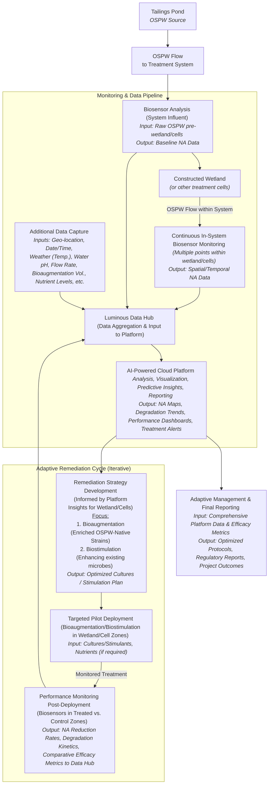

# 1 Technology Opportunity

**Our Solution: An Integrated Biological Approach to Naphthenic Acid Management**

Luminous BioSolutions is advancing an integrated biotechnological platform designed to address the complex and persistent challenge of Naphthenic Acids (NAs) in oil sands process-affected water (OSPW). Current analytical and remediation methodologies face limitations in terms of speed, cost, scalability, and environmental footprint when applied to the vast scale of oil sands tailings facilities. Our approach leverages microbiological principles for a more efficient, sustainable, and data-driven solution:

1. **Rapid, Quantitative Biosensing of Naphthenic Acids:** The foundation of our platform is a panel of proprietary whole-cell bacterial biosensors. These biosensors are engineered using _Pseudomonas_ species, strains native to tailings environments, and specific NA-inducible promoters (e.g., atuA, marR) fused to luxCDABE reporter genes. Upon exposure to NAs, these biosensors exhibit a rapid bioluminescent response, typically within minutes, with light intensity directly proportional to NA concentration. This allows for quantitative assessment. Our research, as detailed in Bookout et al. (2024), demonstrates that these sensors can detect various NA mixtures with limits of detection between **1.5 and 15 mg/L**, a range highly relevant to OSPW conditions (typically 10-120 mg/L NAs ). This technology enables high-throughput screening and near real-time monitoring, offering a significant improvement in data resolution and operational responsiveness compared to conventional analytical chemistry methods. 
![[Pasted image 20250527145927.png]]
	_(A conceptual diagram illustrating the promoter-reporter mechanism would be appropriate here)._
    
2. **Targeted Biological Remediation Strategy:** Beyond detection, our platform facilitates enhanced NA bioremediation. Recognizing the inherent resilience and metabolic capabilities of indigenous OSPW microbial communities, our strategy focuses on:
    
    - **Identifying Potent Native Degraders:** Leveraging our biosensors as high-throughput screening tools to rapidly identify and isolate the most effective NA-degrading bacteria already present and adapted to the harsh OSPW matrix (e.g., varying pH, salinity, co-contaminants).
        
    - **Bioaugmentation & Biostimulation:** This ERA project will pilot the deployment of these selected, superior OSPW-native cultures (bioaugmentation) and explore biostimulation techniques to enhance the degradative activity of the existing microbial consortia _in situ._ This biological approach aims for sustainable NA degradation with a lower environmental footprint and potentially lower operational costs compared to energy-intensive chemical oxidation or physical separation methods, which can also produce secondary waste streams.
        
3. **Data-Driven Environmental Management Platform:** Data from our biosensors are integrated into a cloud-based analytics platform. This system provides real-time visualization of NA spatial and temporal trends, incorporates AI for predictive insights into NA dynamics, and supports streamlined regulatory reporting and transparent stakeholder communication.
    

**Process Flow Diagram** 

**The Problem: A Persistent Challenge Requiring Innovative Solutions** The presence of NAs in the ~1.4 trillion litres of tailings within Alberta's oil sands tailings ponds is a primary contributor to OSPW toxicity and a critical barrier to achieving sustainable reclamation and water management objectives. These compounds delay land reclamation, escalate environmental risks, and contribute to substantial long-term financial liabilities for operators. Existing management practices struggle with the scale, cost, and desire for environmentally benign solutions, highlighting a clear market need for innovative technologies that are both effective and sustainable.

**Transformative Improvement through Integrated Biotechnology** Our integrated biological platform offers a distinct advancement:

- **Enhanced Spatiotemporal Understanding:** Rapid, cost-effective monitoring facilitates a shift from infrequent, low-density sampling to high-resolution mapping of NA distribution and dynamics.
- **Targeted and Sustainable Remediation:** Utilizing adapted, OSPW-native microbes for _in-situ_ degradation offers a potentially more environmentally compatible and cost-effective alternative to chemical or energy-intensive physical treatments, minimizing secondary impacts.
- **Adaptive Management Capability:** Real-time data enables proactive and adaptive management of both monitoring programs and remediation efforts, optimizing for performance and cost.

**Competitive Landscape & Luminous's Differentiators**

Current Naphthenic Acid (NA) management in the oil sands utilizes a range of tools and strategies. Conventional analytical labs (e.g., GC-MS, FTIR) provide accurate NA monitoring but are resource-intensive and yield results with significant time lags. For remediation, alternatives include physical-chemical methods (e.g., Advanced Oxidation Processes, activated carbon) which can be effective but often involve high operational costs, substantial energy demands, and potentially generate secondary waste streams. Passive biological systems like constructed wetlands are under investigation; these offer a more natural approach but typically have large footprints and offer less direct process control over NA degradation rates.

Luminous BioSolutions is designed to enhance and integrate with these existing frameworks, offering unique advantages and synergies:

- **Integrated & Adaptive Intelligence (Our Core Differentiator):** Our primary innovation is the synergistic combination of rapid, quantitative biosensing with a data-driven platform that supports and optimizes biologically-based remediation efforts. This creates an intelligent, adaptive system.
- **High-Resolution Monitoring that Complements Precision Analytics:** Our biosensor panel, validated against OSPW and NAFC extracts, provides timely, cost-effective data essential for high-frequency operational monitoring. This doesn't replace the need for occasional, targeted GC-MS or other high-resolution lab analyses; rather, our biosensors provide the broad, real-time understanding to guide when and where these more intensive analyses are most valuable, ensuring resources are used efficiently.
- **Accelerating Nature-Based Solutions (e.g., Constructed Wetlands):** Our adaptive bioremediation approach, focusing on OSPW acclimatized microbes, is a powerful complement to systems like constructed wetlands. By identifying optimal native microbial consortia or designing effective biostimulation strategies based on real-time biosensor data from within the wetland, we can significantly enhance the NA degradation efficiency and resilience of these biological systems. This means potentially smaller footprints or faster throughput for existing or new wetland designs.
- **Agnostic Data Platform for Holistic Oversight:** Our analytics platform is designed to be versatile. While it natively integrates our biosensor data, it can also incorporate data inputs from various other sensors and monitoring techniques (e.g., pH, temperature, flow rates, even results from conventional lab analyses). This allows for a more holistic, centralized view of the entire treatment process, providing comprehensive insights into the current state and progress of NA remediation, regardless of the specific combination of technologies employed.
- **Targeted Biological Enhancement vs. Broad Chemical/Physical Intervention:** Our biological pathway, focused on selecting and stimulating robust OSPW native microbes, inherently aims to minimize the harsh chemical inputs or high energy demands characteristic of many alternative standalone remediation methods. This offers a more environmentally congruent and potentially more cost-effective route to achieving NA reduction targets.

Luminous BioSolutions seeks to provide the critical missing pieces; rapid, actionable intelligence and targeted biological enhancements, that can make existing and future NA management strategies more efficient, effective, cost-conscious, and environmentally sound.

**Novelty, Innovation & Sustainable Competitive Advantage** 

Our innovation is driven by a unique confluence of cutting-edge science and a dedicated commercialization focus. The scientific underpinnings of our biosensors are detailed in publications such as Bookout et al. (2024). However, Luminous BioSolutions was founded by microbiologists specifically to accelerate such promising research into field-deployable, commercial applications for NA management. Unlike many advancements that remain primarily within academic institutions, our core mission is to provide a holistic, integrated, and practical biological solution to the oil sands industry. This singular focus on NAs, from rapid detection to enhanced bioremediation and intelligent data analysis, provides us with deep, specialized expertise and a clear pathway to delivering tangible results in a complex operational ecosystem. Our advantage stems not just from individual technological components, but from this dedicated, expert-driven mission to solve the NA challenge comprehensively.

**Current Status & Project Advancement** The foundational biosensor technology has achieved TRL 5-6, with functionality demonstrated on actual OSPW samples and various NA mixtures in lab settings and a wetlands field trial. The conceptual framework for the integrated bioremediation and data analytics components is well-defined. This ERA-funded project is designed to advance the entire integrated Luminous system to TRL 7-8. This involves deploying and validating the technology first at at a Meocosm facility then moving towards a pilot scale within an operational oil sands environment, demonstrating its efficacy, robustness, and scalability under real-world conditions.

**ERA's Role in Accelerating Commercialization** 

ERA’s partnership is vital in enabling a specialized, expert-driven company like Luminous to translate deep scientific understanding of NA microbiology into a commercially viable, impactful solution for Alberta. 

- **Validate Field Performance & Scalability:** Bridge the gap from controlled lab environments to the complexities of operational tailings facilities, resolving uncertainties around performance in variable OSPW and at a larger scale.
- **Generate Bankable Data:** Produce the comprehensive, quantitative performance data required by industry operators for adoption and by the AER for regulatory consideration.
- **Optimize the Biological System:** Utilize field data to refine biosensor deployment, optimize the selection and application of bioremediation cultures (or biostimulation parameters), and enhance the predictive capabilities of the data platform.
- **Catalyze a Sustainable Solution:** Support the advancement of a biological solution that offers significant environmental (reduced toxicity, enabling reclamation) and economic (lower monitoring and potentially remediation costs) advantages over conventional chemical/mechanical strategies, aligning with industry's need for effective and sustainable technologies. This project, with ERA's support, will de-risk key technical and operational aspects, significantly accelerating the path to commercial deployment of a uniquely integrated biological solution for NA management.

# 2. Implementation Plan

Our Implementation Plan is built on a staged, iterative methodology, moving from controlled mesocosm environments to operational field pilots. This scientifically grounded approach ensures systematic de-risking, allows for cost-effective optimization at each step, and validates the modular scalability of our integrated Naphthenic Acid (NA) management platform, ensuring a high probability of success in addressing this critical challenge for Alberta's oil sands.

**Overall Objectives, Work Scope, and Deliverables**

The overarching goal is to demonstrate and validate the Luminous BioSolutions platform as a technically robust, environmentally sound, and economically viable solution for managing NAs in oil sands process-affected water (OSPW).

**Key Project Objectives:**

1. **Validate Biosensor Performance & Optimize Remediation Strategies in Mesocosms:** Rigorously test and validate the accuracy, speed, cost-effectiveness, and robustness of our NA biosensor panel under diverse, controlled OSPW conditions (e.g., varying soil, presence of plants) within mesocosm environments. Utilize these real-time biosensor insights to screen, identify, and optimize the most effective bioremediation strategies (bioaugmentation with OSPW-native strains and/or biostimulation).
2. **Demonstrate Integrated System Efficacy in Field Pilots:** Successfully deploy and validate the _entire integrated Luminous system_ incorporating optimized biosensor monitoring protocols and the most promising bioremediation strategies identified in mesocosms at pilot scale within an operational oil sands tailings environment, benchmarking against control areas.
3. **Validate Advanced Data Analytics & Adaptive Management Capabilities:** Showcase the functionality of our AI-powered cloud platform to seamlessly ingest, analyze, and visualize complex, multi-source data (from biosensors, operational parameters, environmental inputs across both mesocosm and field stages), providing actionable insights for real-time adaptive management of the remediation process.
4. **Generate Comprehensive Datasets for Commercial & Regulatory Pathways:** Collect robust, quantitative data on overall technical performance (NA degradation kinetics, biosensor reliability, system stability), holistic environmental benefits (NA reduction, potential GHG mitigation), and key operational parameters from all project stages to support engagement with the AER and build a strong economic case for commercial-scale deployment.
5. **Establish & Document Scalable, Modular Operational Best Practices:** Develop and refine clear, transferable protocols for the efficient deployment, operation, maintenance, and data interpretation of the integrated Luminous system (including biosensor arrays, bioremediation application, and data management), ensuring its design is conducive to modular, linear scale-up for larger commercial applications in the oil sands.

**Work Scope:** The project will initiate with the design, construction, and operation of controlled mesocosm systems. These will act as scaled-down analogues of constructed wetlands or pond sections, allowing us to test our biosensors and compare bioremediation approaches (e.g., OSPW only; OSPW with soil; OSPW with soil and native plants; OSPW with soil, plants, and specific microbial inocula). Learnings will then inform the design and execution of a field pilot at a selected oil sands operational site. This will involve establishing contained pilot zones (treated vs. control), deploying our integrated monitoring and remediation technologies, and conducting continuous performance assessment. Throughout both phases, our data analytics platform will be central to tracking, analysis, and adaptive management.

**Key Deliverables:**

- Mesocosm Design & Operational Plan.
- Mesocosm Trials Performance & Optimization Report (detailing biosensor validation and comparative bioremediation strategy efficacy).
- Field Pilot Detailed Design & Implementation Plan (informed by mesocosm outcomes).
- Validated Biosensor Field Performance Report.
- Field Pilot Bioremediation Efficacy Report (including NA reduction rates, degradation kinetics).
- Fully operational Data Analytics Platform with pilot data.
- Comprehensive Final Project Report (technical achievements, GHG/economic analysis, operational learnings, modular scale-up recommendations).
- MMV Report for ERA.
- Knowledge Dissemination Materials.

**Nature of Deployment, Size/Scale, and Relevance to Commercial System** This project features a two-stage deployment: mesocosm trials followed by a field pilot demonstration.

- **Mesocosm Stage (e.g., Years 1-2):** These controlled experiments (potentially multiple units of 100s-1000s of litres each) will be established at a suitable controlled location (e.g., Luminous facility, partner university, private mesocosm facility, or a designated area on an oil sands lease). This stage allows for rapid, cost-effective iteration and optimization of our biosensors and bioremediation strategies (including selection of most effective OSPW-native strains or biostimulation parameters) under various simulated but controlled conditions. This is critical for de-risking prior to larger field investment.
- **Field Pilot Stage (e.g., Years 2-4):** Based on optimized parameters from the mesocosm trials, a field pilot will be implemented within one or more contained cells/sections of an operational tailings pond or an associated treatment system (e.g., constructed wetland). The scale will be representative of a functional treatment unit (e.g., treating a continuous flow or a significant batch volume of OSPW, targeting X m² surface area or Y m³ volume) capable of generating statistically robust data and demonstrating operational viability.
- **Relevance & Modular Scalability:** This staged approach is inherently designed for linear, modular scalability. The mesocosm phase perfects the "unit process," and the field pilot validates this "treatment module" under real-world conditions. Commercial deployment is envisioned as the replication of these validated modules to address the required scale of tailings ponds, offering predictable performance and cost. The pilot will thus be directly relevant, for instance, as a 1:X representation of a full-scale modular unit, demonstrating the core efficacy that can be multiplied.

**Specific Location(s) of Project Activities**

- **Mesocosm Trials:** A controlled environment in Alberta, potentially at meocosm facilities in InnoTech Alberta (Subsidiary of Alberta Innovates)  or NRCan in Edmonton.
- **Bio Reactor:** Space available at Athabasca University in Athabasca.
- **Lab Testing Facilities:** in existing lab space at the University of Calgary
- **Project Management Office Space:** at Luminous offices at Assembly 
- **Field Pilot Demonstration:** Within an operational oil sands tailings facility in the Athabasca Oil Sands Region (AOSR). Site selection is in progress through discussions with potential host partners, including members of the Pathways Alliance.

**Overview of Project Work Plan, Milestones, and Timeline** The project is planned over a **four-year period (Target: Q1 2026 – Q4 2029)**, structured around our staged deployment:

1. **Phase 1 (Years 1-2 Focus): Mesocosm Validation & Field Preparation.**
    - _Year 1:_ Project initiation, detailed mesocosm design, setup, and commissioning. Initial biosensor validation and screening of bioremediation strategies (bioaugmentation with various OSPW-native strains vs. biostimulation approaches) under controlled OSPW conditions in mesocosms. Commence baseline studies at potential field pilot locations.
    - _Year 2:_ Advanced mesocosm optimization trials (e.g., varying OSPW matrices, simulated seasonal effects where feasible, different microbial inocula/stimulants). Finalize selection of lead bioremediation strategies. Detailed engineering and logistical planning for the field pilot based on robust mesocosm data.
2. **Phase 2 (Years 3-4 Focus): Field Pilot Demonstration & Commercial Pathway Development.**
    - _Year 3:_ Deployment of the integrated Luminous system (optimized from mesocosms) into the selected AOSR field pilot zones. Intensive monitoring of NA degradation, biosensor performance, and overall system operation (treated vs. control areas). Continuous data analysis and adaptive management.
    - _Year 4:_ Long-term field performance validation to assess sustained efficacy and stability. Comprehensive data analysis (technical, GHG, economic), final reporting, development of commercial scale-up plans based on modular design, and knowledge dissemination. _(A detailed Milestone Summary Table, outlining specific tasks, deliverables, timelines, and costs for each phase and its milestones, will be provided as a separate attachment)._

**Summary Budget** The estimated Total Project Budget for this staged program is [$6.0M - $7.0M CAD – NEEDS FINAL VALIDATION]. This budget supports all phases, from mesocosm setup and operation through to full field pilot demonstration and analysis. It covers our dedicated Alberta-based team, specialized equipment (including mesocosm infrastructure, biosensor arrays, bioreactors), materials, analytical services, travel, and overhead, fully aligned with ERA's eligible cost guidelines. A detailed breakdown will accompany the Milestone Summary Table.

**Project Consortium, Roles, Status, and Execution Structure**

- **Lead Applicant: Luminous BioSolutions Inc.** (Overall project lead, technology development & deployment, mesocosm & field operations, data analytics, scientific oversight, reporting).
- **Oil Sands Host Partner(s):** 
	- Canadian Natural Resources - _Status: In Discussion_: Role providing OSPW samples for Mesocosm trials, involvement in constructed wetland pilot.
	- Imperial Oil: Status: in discussions: Role provide OSPW samples for Mesocosm Trials: involvement in phase 2 constructed wetland pilot.
	- Suncor - Status, not contacted yet: Role providing OSPW samples for Mesocosm trials, involvement in constructed wetland pilot.
	- Pathways Alliance - _Status: In Discussion_. Role: Provision of OSPW for mesocosm trials, access to field pilot site(s), operational support, site-specific data, potential in-kind contributions and co-funding.
- **Academic Partners: University of Calgary & Athabasca University** - _Status: Existing Collaboration History, Project-Specific Support TBD_. Role: Access to lab facilities for biosensor testing, advanced microbial characterization, student involvement.
- **Granting Agencies (Anticipated):** Alberta Innovates (PDP), NRC IRAP - _Status: To Be Applied For_. Role: Co-funding. **Execution Structure:** Luminous will spearhead and manage all project phases, ensuring tight integration between mesocosm learnings and field pilot execution. We will establish a joint project steering committee with the host oil sands partner(s) for the field pilot phase to ensure alignment, safety, and operational coordination.

**Core Team Members**

- **Dr. Shawn Lewenza (CSO, Luminous):** Foremost expert in microbiology and the architect of our biosensor technology, with deep experience in NA research. Role: Scientific lead for mesocosm and field trial design, biosensor validation, and bioremediation/biostimulation strategy optimization.
- **Jeff Violo (COO, Luminous):** Decades of experience in operational leadership and strategic execution. Role: Overall Project Director, ensuring efficient execution of both mesocosm and field phases, budget management, and stakeholder relations.
- **Greg Saunders (CTO, Luminous):** Technology and commercialization strategist. Role: Lead for data platform integration, AI analytics development, and ensuring field data translates to commercial insights.
- **Carla Davidson (President, Endeavour Scientific Inc.):** Scientific advisor, Indigenous regulator and local stakeholders advisor / relations.
- **Tyson
- **Key Hires (Alberta-based):** The project will fund a dedicated team including a Project Manager, Field Operations Lead/Technicians (for both mesocosm and AOSR deployment), Lab Scientists/Technicians (for culture work and sensor support), and Data Analysts.
- **Partner Team Members:** Will include designated technical and environmental personnel from the host operator(s) for the field pilot.

**Financial Contributors** _(Please insert the ERA-provided table format here, populated with your confirmed/estimated amounts and current statuses for each source, as discussed previously)._

**(Overall Plan for Financing and Timelines)** Our financing strategy leverages ERA's crucial support (targeting ~50% of project costs) and combines it with Luminous BioSolutions' investment, anticipated non-dilutive grants (Alberta Innovates, NRC IRAP), and contributions from our oil sands host partner(s). We are actively pursuing these avenues and aim for full funding commitment **within 6-8 months post-ERA EOI success**, facilitating a timely project start.

**(Line of Sight from Current Status to Project Start)** We are well-prepared for a Q1 2026 project initiation. Current activities include advancing discussions with potential AOSR host partners for OSPW supply (for mesocosms) and field pilot sites. Key steps to full project launch include:

1. Successful ERA EOI & Full Project Proposal.
2. Formalizing host partner agreements (mesocosm OSPW access & field site).
3. Securing all co-funding commitments.
4. Luminous internal resource finalization.
5. Hiring core Alberta-based project team.
6. Procurement for mesocosm setup and initial field equipment.
7. Finalizing detailed HSE and operational plans for mesocosm phase.

**Key Risks and Mitigation Plan** Our staged, iterative deployment (mesocosm to field) is a primary risk mitigation strategy for technical and scale-up challenges.

- **Technical Risk (Biological System Performance):** Variability in OSPW affecting biosensor accuracy or bioremediation efficacy. _Mitigation:_ Extensive testing across diverse OSPW conditions in controlled mesocosms allows for optimization _before_ field deployment; focus on robust, OSPW-native microbes; adaptive management informed by real-time data.
- **Operational Risk (Field Deployment in AOSR):** Logistical complexities, safety. _Mitigation:_ Learnings from mesocosm operations inform field protocols; close collaboration with experienced host partner teams; comprehensive HSE plans.
- **Scale-Up Risk (Mesocosm to Field & Beyond):** Ensuring findings translate effectively. _Mitigation:_ Mesocosm design to mimic key field parameters; field pilot focuses on validating a scalable modular unit; continuous data analysis to refine scale-up models.
- **Regulatory Acceptance:** Data requirements for AER. _Mitigation:_ Proactive engagement strategy with AER, Indigenous, and local stakeholders ; project designed to generate robust validation data benchmarked against standard methods.
- **Co-Funding:** Securing matching contributions. _Mitigation:_ Strong value proposition for partners; pursue multiple grant opportunities; phased project plan can offer some flexibility.

**Why ERA Funding is Requested:** 

Luminous BioSolutions is at a critical juncture: we have scientifically grounded, lab-proven components for a transformative biological solution to Naphthenic Acid (NA) management. However, the journey from promising research to a field-deployed, commercially viable system for the complex oil sands environment presents significant technical, operational, and financial hurdles that ERA funding is uniquely positioned to help us overcome.

**ERA's partnership is essential to mitigate key barriers and accelerate impact:**

1. **De-Risking Critical Field Validation & Scale-Up:**
    - The primary barrier is validating our integrated system (biosensors, bioremediation with OSPW-native microbes, data platform) under real-world, variable OSPW conditions and at a meaningful scale. While our staged mesocosm-to-field pilot approach is designed to meticulously de-risk this process, it is resource-intensive.
    - ERA funding directly enables this crucial validation. It allows us to bridge the "valley of death" by funding the comprehensive testing in controlled mesocosms to optimize parameters _before_ progressing to larger, more complex field demonstrations. This mitigates the Technical Risk of underperformance and the Scale-Up Risk by proving the efficacy of a scalable modular unit. Without this support, achieving the necessary level of field validation to gain industry confidence would be significantly slower and more challenging for an innovation-driven company like ours.
    
2. **Generating "Bankable" Data for Industry Adoption & Regulatory Acceptance:**
    - Individual operators may be hesitant to fully fund the extensive validation required for a novel, integrated biological platform. ERA's co-investment facilitates the generation of independent, robust, and transparent performance data.
    - **This ERA-supported data generation is vital for:**
        - Building the confidence of oil sands operators for broader commercial adoption by clearly demonstrating technical efficacy and potential cost savings compared to conventional chemical/mechanical approaches.
        - Supporting our proactive engagement with the Alberta Energy Regulator (AER), providing the credible, benchmarked data necessary to facilitate **Regulatory Acceptance** of our novel monitoring and remediation techniques.
3. **Accelerating an Alberta-Grown, Environmentally Superior Solution:**
    
    - Luminous offers an innovative, biological pathway that inherently avoids the harsh chemical inputs and high energy demands of many alternative NA treatment methods, promising a more sustainable and environmentally sound approach. As a specialized Alberta company founded by microbiologists dedicated to solving the NA challenge, we are committed to keeping this innovation and its benefits within the province.
    - **ERA funding acts as a powerful catalyst**, accelerating the development and deployment of this made-in-Alberta solution. This not only addresses a critical environmental issue for a key provincial industry but also enhances Alberta's leadership in cleantech. It also strengthens our position to secure **Co-Funding** by signaling strong project viability and government backing.

**Justification of Funding Amount:** The requested funding of **[$3.0M - $3.5M Estimate – NEEDS FINAL VALIDATION]** is directly tied to the comprehensive scope of this multi-year, staged validation program. It will support our dedicated Alberta-based expert team, the establishment and operation of controlled mesocosm facilities, the execution of rigorous field pilots in the AOSR (including specialized equipment, consumables, and analytical services), and the robust data analysis required. This investment represents a strategic allocation of TIER funds to thoroughly de-risk and prove a technology with a high potential for significant, industry-wide environmental and economic benefits, moving it decisively towards commercial success.