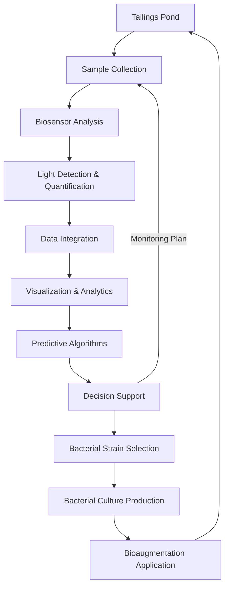

**Expression of Interest**

**Emissions Reduction Alberta**

**Industrial Transformation Challenge - 2025**

**Proposal Information**

---

Project Title: Illuminating Solutions for Oil Sands Tailings: Tackling the Naphthenic Acid Challenge

Applicant Organization Luminous BioSolutions Inc. (Legal name):

Project Location(s): Northern Alberta Oil Sands / Calgary, Alberta

Project Start Date: January 1, 2026

Project Completion Date: December 31, 2028

Total Project Budget: $4,800,000

Total Project Eligible $4,600,000 Cost:

Requested ERA Funding: $2,300,000

Applicant Contact Name: Jeff Violo

Applicant Contact Email: Jeff.violo@luminousbiosolutions.com

---

## 1. Technology Opportunity

### Integrated Solution for Naphthenic Acid Monitoring and Remediation

Luminous BioSolutions has developed an integrated three component system to address one of Alberta's most persistent environmental challenges; naphthenic acids (NAs) in oil sands process-affected water (OSPW).  NAs are acutely toxic compounds that persist for decades, preventing water release and hindering reclamation efforts across 1.4 trillion litres of stored OSPW.

Figure 1: Integrated NA monitoring, data analytics, and remediation system

#### Our solution combines:

1. **Rapid Bacterial Biosensor Technology**: Engineered bacteria emit light in direct proportion to NA concentration, providing quantitative results within minutes versus weeks for conventional methods. The biosensors contain synthetic genetic circuits that respond specifically to different classes of naphthenic acids, activating the production of a bioluminescent protein. Light output is measured using portable luminometers, with intensity directly proportional to NA concentration. These biosensors are tailored to detect specific NA compound classes, enabling comprehensive screening, and can be deployed in field conditions.

2. **Real-Time Data Analytics Platform**: A cloud-based system aggregates biosensor data across monitoring points, providing visualization, trend analysis, and predictive insights. The platform integrates geospatial data with temporal trends, enabling operators to map NA concentration patterns, identify hotspots, and track remediation progress. Customized dashboards provide relevant information to different stakeholders, operational metrics for operators, compliance data for regulators, and transparency for communities.

3. **Targeted Bioaugmentation**: Selected native bacteria from oil sands tailings environment are cultivated and applied to accelerate NA degradation; a process proven effective in laboratory and mesocosm studies. These bacteria express enzymes capable of breaking down the cyclic and acyclic structures of NAs, converting them to less toxic compounds that can be further metabolized. Application methods include direct injection, floating bioreactors, and enhanced constructed wetlands.

### Transformative Improvement Over Current Practice

Current approaches to NA management involve expensive analytical chemistry (FTIR, GC-MS) with weeks-long turnaround times, severely limiting testing frequency and responsiveness to remediation strategies. There are no cost-effective screening remediation technology exists at this industrial scale. 

Our solution's advantages include:

| **Current Practice**          | **Luminous Solution**            | **Improvement Factor**        |
| ----------------------------- | -------------------------------- | ----------------------------- |
| 2-4 week result turnaround    | Minutes to hours                 | ~100X faster                  |
| $250-1,000 per sample         | $10-50 per sample                | ~20X cost reduction           |
| Limited testing frequency     | Continuous monitoring possible   | 50-100X more data points      |
| Passive containment only      | Active remediation               | Enables reclamation pathway   |
| Limited spatial coverage      | Comprehensive monitoring         | 10-20X more monitoring points |
| No real-time data integration | Comprehensive analytics platform | Enables proactive management  |
### Competitive Alternatives

Current NA remediation approaches each have significant limitations compared to our bioaugmentation approach:

- ==**Physical/Chemical Treatment**: Methods like ozonation or advanced oxidation processes require substantial energy input (15-20 kWh/m³), create harmful by-products, and are prohibitively expensive at scale ($3-5/m³). These approaches can achieve 30-70% NA removal but are typically impractical for the vast volumes of OSPW.==
- ==**Chemical Amendments**: Adding polymers or coagulants may reduce some toxicity but don't address the NA compounds directly. These methods typically cost $1-2/m³ but achieve only 10-30% NA reduction and can introduce other chemicals of concern.==
- ==**Constructed Wetlands**: While effective over long timeframes (3-5 years), conventional wetlands require large land areas and have variable performance depending on climate and NA concentration. Our approach can accelerate and optimize wetland performance through targeted bioaugmentation.==
- ==**Passive Natural Attenuation**: Current default approach requires 20-40 years for significant NA reduction with no active management. Our bioaugmentation would significantly accelerate NA remediation by introducing optimized bacterial communities, reducing this timeframe to 2-5 years.==

### Novel and Innovative Aspects

- **First Integrated Solution**: No existing commercial solution to this problem combines rapid detection, data analytics, and targeted remediation in an integrated system. This holistic approach allows for continuous improvement through a feedback loop between monitoring and treatment optimization.
- **Patented Biosensor Technology**: Our bacterial biosensors (patent pending) utilize synthetic biology to create NA-specific light responses unseen in any commercial application. The genetic circuits are designed with specificity for different NA compound classes, enabling comprehensive assessment of total toxicity. This is a critical component for addressing remediation strategies as it informs decisions in near real time. 
- **Indigenous Bacterial Strains**: We've isolated and characterized native bacteria specifically evolved to degrade NAs in the oil sands tailings ponds unique climate and conditions. These strains are already adapted to the local environment, enhancing survival and performance while minimizing environmental concerns.
- **Data-Driven Remediation**: Real-time monitoring enables precise application and verification of remediation effectiveness, optimizing resource use. The analytics platform applies machine learning algorithms to identify optimal treatment conditions and predict remediation outcomes.
### Current Status and Advancement

The technology is currently at TRL 5-6, with:

- **Biosensors**: Laboratory validation complete using OSPW samples from multiple sources. Demonstrated detection limits of 5-15 mg/L for key NA compound classes, with linear response up to 150 mg/L. Validated against standard analytical methods with >90% correlation.
- **Data Platform**: Architecture designed and beta version developed with core functionality for data integration and visualization. Initial machine learning models trained on laboratory datasets.
- ==**Bioaugmentation**: three bacterial strains identified with significant NA degradation capability, demonstrating 40-60% reduction of total NAs within 60 days under laboratory conditions. Preliminary mesocosm testing shows promising results.==

Through this project, we will advance to TRL 7-8 by:

1. ==Optimizing biosensor formulations for field conditions, improving robustness, shelf-life, and performance in variable environments
2. Developing field-deployable biosensor kits and protocols for non-laboratory settings
3. Building the full data platform with stakeholder-specific interfaces and predictive analytics
4. Testing bioaugmentation at increasing scales: laboratory → mesocosms → field implementation
5. Validating the integrated system's performance in actual tailings pond conditions

ERA investment will accelerate commercialization by:

- **Reducing Technical Risk**: Field testing will validate laboratory performance under real-world conditions, providing the evidence needed for broader adoption.
- **Addressing Scale-Up Challenges**: Support for bioreactor design and production scale-up will overcome key manufacturing barriers.
- **Enabling Data Infrastructure**: Development of the analytics platform will create the foundation for operational implementation and regulatory reporting.
- **Building Industry Confidence**: Demonstration at an operational site will provide the validation needed to overcome the industry's technology adoption conservatism.
- **Creating Implementation Protocols**: Field implementation will establish standard operating procedures required for commercial deployment.

Without ERA funding, commercialization would likely be delayed by 3-5 years, as each component would need to be developed sequentially through smaller initiatives, rather than as an integrated system with field validation.

## 2. Implementation Plan

### Project Objectives, Work Scope, and Deliverables

**Primary Objective**: Demonstrate and validate Luminous BioSolutions' integrated naphthenic acid monitoring and remediation system at field scale, advancing the technology from TRL 5-6 to TRL 7-8 and establishing commercial deployment protocols.

**Specific Objectives**:
1. Optimize biosensor technology for field deployment conditions
2. Develop scalable bacterial culture production and application methods
3. Build and validate the integrated data analytics platform
4. Demonstrate system effectiveness in reducing NA concentrations in operational OSPW
5. Establish performance metrics and regulatory compliance protocols
6. Create commercial implementation framework for industry-wide adoption

**Work Scope**: Three-phase approach progressing from laboratory optimization through controlled testing to field demonstration:
- Phase 1: Laboratory optimization and production protocol development
- Phase 2: Controlled environment testing and system integration
- Phase 3: Field implementation and performance validation

**Key Deliverables**:
- Field-ready biosensor production protocols and equipment
- Validated bacterial cultivation and application systems
- Fully functional data analytics platform with stakeholder interfaces
- Demonstrated NA reduction performance in operational tailings pond environment
- Regulatory compliance documentation and protocols
- Commercial scaling and implementation plan

### Nature of Deployment and Scale

**Deployment Type**: Field demonstration transitioning from pilot to first-of-kind deployment

**Scale**: [NEED INFORMATION - What specific scale are you targeting for the field demonstration? e.g., treatment area size, volume of water]

**Relevance to Commercial System**: The field demonstration will validate all core system components at a scale that proves commercial viability while allowing for modular expansion. Each component (monitoring stations, bacterial application systems, data integration) will be designed for scalable deployment across multiple sites.

### Project Locations

- **Laboratory Work**: Luminous BioSolutions office Calgary, Athabasca University and University of Calgary facilities
- **Controlled Testing**: University of Calgary mesocosm facilities
- **Field Implementation**: [NEED INFORMATION - Has a specific oil sands site been identified or are you still in discussions?]

### Project Consortium and Execution Structure

| **Organization**        | **Role**                      | **Status**    | **Key Responsibilities**                                      |
| ----------------------- | ----------------------------- | ------------- | ------------------------------------------------------------- |
| Luminous BioSolutions   | Lead Proponent                | Confirmed     | Project management, technology integration, commercialization |
| Athabasca University    | Academic Partner              | Confirmed     | Biosensor optimization, laboratory facilities                 |
| University of Calgary   | Academic Partner              | Confirmed     | Bacterial culture development,                                |
| Endeavour Scientific    | Indigenous Engagement Partner | Confirmed     | Stakeholder engagement, knowledge translation                 |
| [Oil Sands Operator]    | Industry Partner              | In Discussion | Field site provision, technical guidance                      |
| Pathways Alliance/COSIA | Industry Consortium           | In Discussion | Knowledge sharing, technical advisory                         |
| ==Meocosm facility==    | Pilot Facility Partner        |               | mesocosm testing                                              |
| Vogon Labs              | Testing Partner               |               | ==MS Testing==                                                |

### Core Team Members

**Luminous BioSolutions Team**:

- Jeff Violo (Co-founder, COO): Project leadership and operational management
- Dr. Shawn Lewenza (Co-founder, CSO): Technology development and scientific oversight
- Greg Saunders (Co-founder, CTO): Technical systems integration

**Key Partner Representatives**:

- Dr. Carla Davidson (Endeavour Scientific): Indigenous engagement and knowledge translation
- [NEED INFORMATION - Academic team members from Athabasca and UofC]
- [NEED INFORMATION - Industry partner representatives]

### Risk Assessment and Mitigation

|**Risk Category**|**Specific Risk**|**Mitigation Strategy**|
|---|---|---|
|Technical|Field performance differs from laboratory results|Extensive mesocosm validation; adaptive optimization protocols|
|Regulatory|Delays in field testing approvals|Early engagement with AER; regulatory pathway mapping|
|Partnership|Industry partner commitment delays|Multiple parallel discussions; flexible implementation timeline|
|Environmental|Seasonal/weather constraints|Schedule flexibility; contingency periods built into milestones|
|Financial|Funding timeline misalignment|Diversified funding strategy; staged implementation approach|

### ERA Funding Justification

ERA funding is critical to bridge the "valley of death" between laboratory success and commercial deployment. Specific barriers addressed:

1. **Technical Risk Reduction**: Field validation at operational scale is essential to prove commercial viability
2. **Industry Adoption Barrier**: First deployment risk is too high for industry partners without proven field performance
3. **Infrastructure Development**: Data platform, bio reactor and field equipment development requires upfront investment not justified for single implementation
4. **Regulatory Pathway**: Demonstration project provides data necessary for regulatory approval of broader implementation

==**Information Still Needed**:==

1. **Budget Details**: What is our target total project budget and ERA funding request amount?
    
2. **Financial Contributors**: Specific funding commitments and amounts from:
    - Luminous BioSolutions (cash and in-kind)
    - Industry partners
    - Other potential funders (Genome Alberta, Alberta Innovates, etc.)
    - Investors
    
3. **Field Site Details**:
    - Has a specific site been identified?
    - What scale of implementation is planned?
    - Any specific agreements or MOUs in place?
    
4. **Academic Team Details**: Key personnel from university partners and their specific roles
    
5. **Timeline Specifics**: What are your target start and end dates, and key milestone timing?
    
6. **Technical Specifications**: Any specific performance targets or success criteria you want to include?
    
7. **Regulatory Requirements**: Any specific permits or approvals needed for field testing?
    

Once you provide this information, I can complete the Implementation Plan section with accurate, verifiable details that reflect your actual project scope and partnerships.
## 3. GHG Benefits

### GHG Reduction Mechanisms

Our solution delivers greenhouse gas benefits through three primary mechanisms:

1. **Direct Emissions Reduction**: Tailings ponds are significant sources of methane and CO₂ emissions as hydrocarbons and organic materials degrade under anaerobic conditions. By accelerating NA degradation through aerobic bacterial processes, we convert what would be methane emissions (25x the GWP of CO₂) to carbon dioxide, significantly reducing GHG impact.
    
2. **Reduced Energy Intensity**: Alternative treatment technologies such as ozonation or advanced oxidation processes require 15-20 kWh per cubic meter of water treated. Our biological approach requires approximately 1-2 kWh per cubic meter, primarily for aeration and pumping, resulting in 85-90% less energy consumption and associated emissions.
    
3. **Accelerated Reclamation**: By enabling faster water treatment and release, our technology accelerates the timeline for tailings pond closure and reclamation. This allows for earlier conversion of disturbed land to carbon-sequestering ecosystems.
    

### Quantitative Project GHG Benefits

Direct GHG reductions from the project implementation are estimated as follows:

1. **Methane Avoidance**: Based on measured tailings pond emission factors of 0.5-1.2 kg CH₄/m² annually, our 10,000 m³ demonstration (approximately 2,000 m² surface area) will reduce emissions by 25-60 tonnes CO₂e annually.
    
2. **Energy Savings vs. Alternative Treatment**: For treating 10,000 m³ of water, conventional methods would require 150,000-200,000 kWh of energy, producing approximately 75-100 tonnes CO₂e. Our approach requires 10,000-20,000 kWh, producing 5-10 tonnes CO₂e, for a net reduction of 70-90 tonnes CO₂e.
    

Total direct annual GHG reductions from the demonstration project: 95-150 tonnes CO₂e. Cumulative project GHG benefit over 3 years: 285-450 tonnes CO₂e.

### Market Implementation GHG Potential

With approximately 1.4 trillion liters of OSPW requiring treatment, the market-wide GHG reduction potential is substantial:

|**Timeline**|**Market Penetration**|**Water Treated (m³)**|**Annual GHG Reduction (tCO₂e)**|**Cumulative Reduction (tCO₂e)**|
|---|---|---|---|---|
|By 2030|15%|210 million|199,500-315,000|597,000-945,000|
|By 2040|45%|630 million|598,500-945,000|6,582,000-10,395,000|
|By 2050|75%|1.05 billion|997,500-1,575,000|16,557,000-26,145,000|

These estimates assume:

- Market penetration increasing as technology demonstrates effectiveness
- Approximately 95-150 tCO₂e reduction per 10,000 m³ treated annually
- Implementation primarily in Alberta with 100% of benefits realized within the province

### Contribution to Net-Zero Goals

Our solution directly supports oil sands operators' net-zero commitments by addressing a significant source of scope 1 emissions from tailings ponds while enabling more efficient land reclamation. Several major operators have specifically identified tailings management as a key element of their emission reduction strategies.

For example, the Pathways Alliance's net-zero plan identifies "improved recovery and management of fugitive emissions" as a key action area. Our technology directly supports this objective by converting potential methane emissions to CO₂ through managed aerobic degradation.

Furthermore, by enabling a pathway to water release and pond closure, our technology supports the transition of disturbed lands back to carbon-sequestering ecosystems, providing additional long-term climate benefits beyond the operational phase.

## 4. Economic and Environmental Benefits

### Non-GHG Environmental Benefits

Our integrated solution delivers multiple environmental benefits beyond GHG reductions:

**Water Quality Improvement**: Naphthenic acids are the primary toxicity driver in OSPW. Our field demonstration will reduce NA concentrations by 40-60% in the treatment area, with potential for >80% reduction through repeated application. At market scale, this represents significant progress toward water quality suitable for release or reuse.

**Land Reclamation Enablement**: By addressing the persistent toxicity of NAs, our solution removes a critical barrier to tailings pond closure and land reclamation. Each hectare of reclaimed land represents restoration of habitat and ecosystem services valued at approximately $4,000-$6,000 per hectare annually.

**Reduced Risk of Contamination**: Active management and monitoring reduces the risk of seepage or uncontrolled release of untreated water. Our continuous monitoring system provides early detection capabilities that current infrequent testing cannot match.

**Biodiversity Protection**: NAs are acutely toxic to aquatic life, with LC50 values of 4-8 mg/L for fish species. By reducing NA concentrations below these thresholds, our technology helps protect regional biodiversity from potential impacts.

### Economic Benefits

**Cost Savings for Operators**:

- Monitoring cost reduction: 80-90% savings versus conventional methods
- Reduced liability: Accelerated reclamation reduces the estimated $45-50 billion industry-wide tailings liability
- Regulatory compliance: Enables progress toward water release requirements

**Economic Impact for Alberta**:

- Technology commercialization: Establishes Alberta as a global center for biological remediation technology
- Export potential: International market for similar mining water treatment estimated at $2.5-3 billion annually
- Supply chain development: Local production of biosensors and bacterial cultures creates new industrial opportunities

**Job Creation and Retention**:

- Direct project employment: 12-15 FTE positions during demonstration phase
- Commercial implementation: Potential for 40-50 permanent positions at full commercialization
- Indirect employment: Estimated 3-4x multiplier in supporting industries
- All core jobs located in Alberta with technical positions requiring advanced education

### Potential Negative Impacts

Our solution has minimal negative impacts compared to alternatives:

- **Minimal energy requirements**: Primarily for aeration and pumping (1-2 kWh/m³)
- **No chemical additions**: Purely biological approach using native bacteria
- **No waste stream creation**: Unlike chemical or physical methods that concentrate contaminants
- **Safety**: All bacterial strains are naturally occurring, non-pathogenic, and indigenous to the region

### Ancillary Benefits

**Indigenous Engagement**: Through our partnership with Endeavour Scientific, we will implement a comprehensive Indigenous engagement strategy that:

- Provides communities with transparent monitoring data
- Creates opportunities for local employment in monitoring and remediation
- Builds trust through knowledge sharing and inclusion in implementation planning

**Educational & Research Advancement**: Our collaboration with Athabasca University and University of Calgary creates opportunities for:

- Graduate student research and training
- Development of specialized expertise in environmental biotechnology
- Knowledge transfer through scientific publications and presentations

**Regional Reputation Enhancement**: Successful implementation demonstrates Alberta's leadership in responsible resource development, potentially improving public perception of oil sands operations.

## 5. Market and Value Proposition

### Target Market and Customers

The primary market for our solution is oil sands mining operators managing tailings ponds in Alberta's Athabasca region. This includes:

- Suncor Energy
- Canadian Natural Resources Limited (CNRL)
- Imperial Oil/ExxonMobil (Kearl operations)
- Syncrude Canada Ltd.

These operators collectively manage approximately 30 active tailings ponds covering over 300 km² and containing an estimated 1.4 trillion liters of OSPW.

### Alberta Market Potential

The market for our solution in Alberta encompasses:

- **Monitoring Services**: Current analytical testing market for NA analysis estimated at $15-20M annually, with growth potential to $30-40M with increased testing frequency.
- **Remediation Services**: Total addressable market of approximately $1.2-1.5B for treatment of existing tailings ponds over 15-20 years.
- **Data Management Platform**: Recurring revenue opportunity of $3-5M annually through SaaS model.

Implementation potential includes:

- 25-30 active tailings facilities
- 300+ monitoring points per facility
- Treatment capacity requirements of 70-100 million m³ annually

### Export Potential

The solution has significant potential for application in other markets:

**Canadian Oil Sands (Steam-Assisted Gravity Drainage)**: SAGD operations produce approximately 25-35 million m³ of process-affected water annually, representing a smaller but growing market.

**International Mining Operations**: Similar challenges exist in:

- Heavy oil production (Venezuela, Russia)
- Oil shale development (US, Estonia)
- Mining operations with organic acid contamination (global)

International market potential is estimated at 3-4x the Alberta market size.

### Applicability to Other Sectors

Core technologies can be adapted to address:

- **Municipal Wastewater**: Biosensor adaptation for monitoring emerging contaminants
- **Agricultural Runoff**: Detection and remediation of persistent pesticides and herbicides
- **Industrial Effluent**: Monitoring and treatment of phenolic compounds and other toxic organics
- **Environmental Monitoring**: Rapid field detection of various organic contaminants

### Commercial Economics

At commercial scale, our solution offers compelling economics:

|**Component**|**Capital Cost**|**Operating Cost**|**Value Delivered**|**ROI**|
|---|---|---|---|---|
|Monitoring System|$500K-$1M per site|$5-10 per sample|80-90% cost reduction vs. conventional|1-2 years|
|Bioaugmentation|$2-4M per site|$0.50-0.75 per m³ treated|Accelerated NA reduction; liability reduction|3-5 years|
|Data Platform|$250-500K implementation|$100-200K annual subscription|Regulatory compliance; operational insights|1-3 years|

Combined solution ROI: 2-4 years based on monitoring cost savings and accelerated reclamation timeline.

### Implementation Pathway

Post-project commercial implementation will proceed through:

1. **Expansion to Full-Scale Site**: Working with demonstration partner to scale from pilot area to full tailings facility
2. **Multi-Site Deployment**: Leveraging success metrics to expand to additional operators
3. **Service Model Development**: Establishing ongoing monitoring and treatment services
4. **Technology Enhancement**: Continued R&D to improve effectiveness and expand applications
5. **Market Expansion**: Adaptation for international markets and other sectors

### Commercialization Challenges and Barriers

**Regulatory Acceptance**: Working with AER to establish performance metrics and approval pathways for water treatment and potential release.

**Scale-Up Costs**: Initial capital investments for full-scale implementation requiring demonstration of economic returns.

**Industry Adoption**: Conservative approach to new technologies requiring compelling field performance data.

**Production Capacity**: Developing manufacturing capacity for biosensors and bacterial cultures at commercial scale.

### Knowledge Sharing Plan

Our knowledge dissemination strategy includes:

**Industry Knowledge Sharing**:

- Quarterly reports through Pathways Alliance/COSIA
- Industry workshops demonstrating technology application
- Case studies documenting implementation experience

**Academic Knowledge Transfer**:

- Peer-reviewed publications on technology performance
- Graduate student training and thesis development
- Conference presentations at key environmental forums

**Public and Stakeholder Communication**:

- Non-technical summaries for community stakeholders
- Transparent reporting on environmental performance
- Educational materials on biological remediation approaches

**Indigenous Community Engagement**:

- Dedicated knowledge sharing sessions with affected communities
- Collaborative monitoring initiatives with community members
- Development of accessible data visualization tools